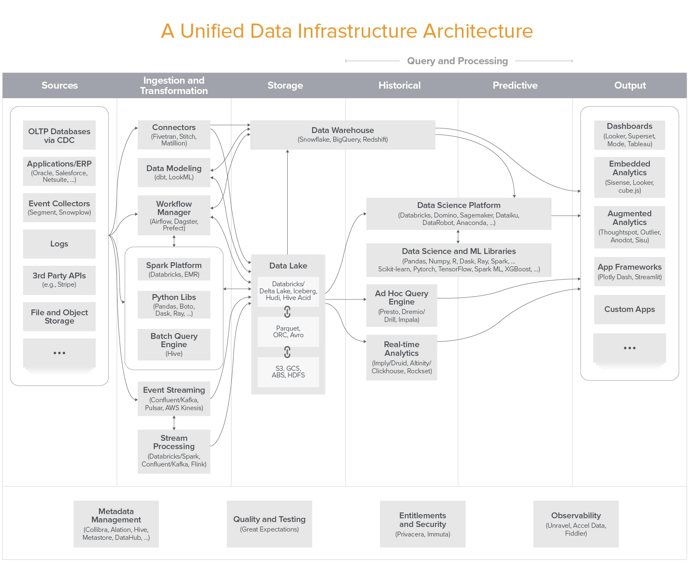

- Read
	- [自动调整 GOGC 优化 GO 的 GC CPU 占用](https://xargin.com/dynamic-gogc/)
		- 介绍了 [[Uber]] 在优化 [[Golang]] GC 时 CPU 占用的一些尝试
	- [New – Replication for Amazon Elastic File System (EFS)](https://aws.amazon.com/blogs/aws/new-replication-for-amazon-elastic-file-system-efs/)
		- AWS EFS 支持 Replication 了
		- 一开始觉得很奇怪才支持这样的功能，想了想 FS 想做 replication 确实要比对象存储复杂很多
	- [Emerging Architectures for Modern Data Infrastructure](https://future.a16z.com/emerging-architectures-modern-data-infrastructure/)
		- a16z 是鼎鼎大名的创投机构，先后投中了 [[Facebook]], [[Twitter]], [[Skype]], [[Airbnb]], [[Stripe]] 等多家成功的公司。
		- 这篇文章介绍了现代数据基础设施的新架构，值得每个从事数据行业的人阅读
		- > 据说现在大数据领域的创投都在问公司你们在图上的哪个位置？
			- {:height 568, :width 686}
-