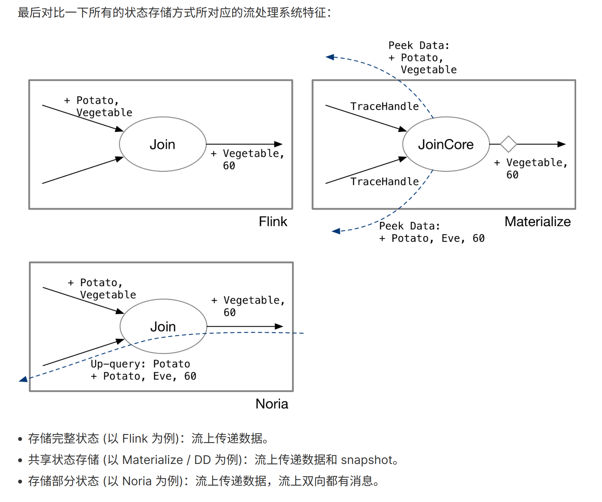

- [Panics vs cancellation, part 1](https://smallcultfollowing.com/babysteps/blog/2022/01/27/panics-vs-cancellation-part-1/) #read
	- [@nikomatsakis](https://github.com/nikomatsakis) 认为 Async Cancellation 跟 Panic 有相似之处
	- > In Rust, our cancellation story is centered around dropping. The idea is that to cancel a future, you drop it. Whenever you drop any kind of value in Rust, the value’s destructor runs which has the job of disposing of whatever resources that value owns.
	- > In effect, if you look at things from the “inside view” of the async fn, cancellation looks like the await call panicking – it unwinds the stack, running the destructors for all values.
	- 他的下一篇文章将会研究 Async Cancellation 的实例，尝试指出它是如何使用的，以及它为什么会比 panic 引起更多问题。
- [Qualifying Filesystems for Seastar and ScyllaDB](https://www.scylladb.com/2016/02/09/qualifying-filesystems/) #read
	- [[ScyllaDB]] 使用 [seastar](http://seastar.io/) 作为 I/O 框架
		- > Under the hood, seastar uses libaio, which in turn uses the io_submit(2) and io_getevent(2) system calls to submit I/O commands to the kernel to be processed asynchronously, and to gather command completions respectively.
	- Linux AIO 的缺点
		- no buffered I/O
		- use a filesystem that has good support for AIO
			- 文中(2016年)主要指 [[XFS]]
	- [[XFS]] and appending writes
		- 当文件系统不支持 async append write 的时候
		- > Linux silently converts the asynchronous request to a synchronous one
		- 当 Scylla 认为它把一个写操作交给内核在后台处理时，实际上它正在等待写操作进入磁盘并完成。在这个过程中，提交请求的内核是空闲的。
		- 这会导致性能的极大降低
	- 所以 Scylla 开发了 [fsqual](https://github.com/avikivity/fsqual)
		- 用来检测文件系统对 async appending write 的支持
	- 这篇文章已经比较旧了，目前 [[ScyllaDB]] 正在积极探索对 [[io_uring]] 和 [[eBPF]] 的支持
		- [How io_uring and eBPF Will Revolutionize Programming in Linux](https://www.scylladb.com/2020/05/05/how-io_uring-and-ebpf-will-revolutionize-programming-in-linux/)
- [Message Queuing and the Database: Solving the Dual Write Problem](https://www.cockroachlabs.com/blog/message-queuing-database-kafka/) #read
	- 没啥想法
- [流处理系统中状态的表示和存储](https://www.skyzh.dev/posts/articles/2022-01-15-store-of-streaming-states/) #read
	- 适合像我这样对 StreamingDB 不太了解的人阅读，现在还不是很能完全理解
	- 最后的总结比较精髓
		- 
- [High-Performance Networking Using eBPF, XDP, and io_uring](https://www.p99conf.io/session/high-performance-networking-using-ebpf-xdp-and-io_uring/) #read
	- 没啥感触，不过知道了 [DataDog/glommio](https://github.com/DataDog/glommio)