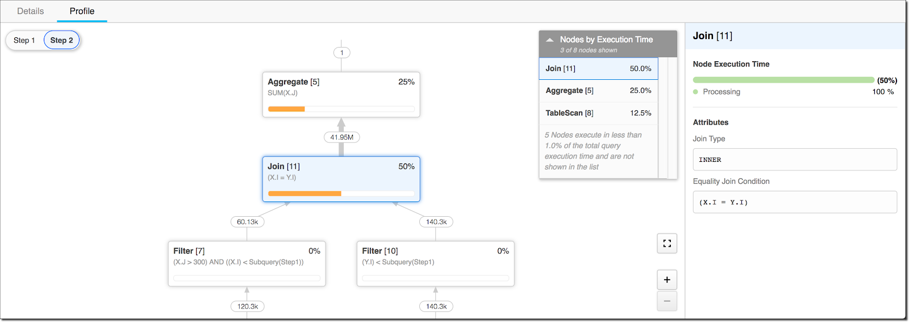

- [[PushdownDB: Accelerating a DBMS using S3 Computation]] #read
- [The 5 Main Features of Web 3.0](https://www.expert.ai/blog/web-3-0/) #read
	- 没啥想法
	- BTW，页面的基本呈现都很有问题。。
- [What happens when you profile a continuous profiler?](https://pyroscope.io/blog/profile-continuous-profiler/) #read
	- 来自 [pyroscope](https://pyroscope.io) 的博客
	- 文章分享了 pyroscope 内部使用 pyroscope 来 profile 自己的过程经历
- [Changes in the Core Team](https://blog.rust-lang.org/2022/01/31/changes-in-the-core-team.html) #read
	- Steve Klabnik, Florian Gilcher 和 Pietro Albini 退出了 core team
- [Tech debt gets worse before it gets better](http://jeremymikkola.com/posts/2022_01_29_tech_debt_gets_worse_before_it_gets_beffer.html) #read
	- > First, don’t wait too long to start paying off tech debt. You don’t want to be in a situation where temporarily making it any worse is unbearable.
	- > Second, don’t stop clean-up projects in the middle. If you do, you may be left worse off than you started.
- [What Do I Do When My Snowflake Query Is Slow? Part 1: Diagnosis](https://rockset.com/blog/what-do-i-do-when-my-snowflake-query-is-slow-part-1-diagnosis/) #read
	- > Check the Query History Page
		- ```sql
		  select *
		    from table(information_schema.query_history_by_session())
		    order by start_time;
		  ```
		- `EXECUTION_STATUS`： 执行状态
		- `QUEUED_PROVISIONING_TIME`: 用于等待 warehouse 分配的时间
		- `QUEUED_REPAIR_TIME`: 用于修复 warehouse 的时间
		- `QUEUED_OVERLOAD_TIME`: warehouse 过载的时间
	- 
	- 姊妹篇: [What Do I Do When My Snowflake Query Is Slow? Part 2: Solutions](https://rockset.com/blog/what-do-i-do-when-my-snowflake-query-is-slow-part-2-solutions/)
		- 调整参数来减少排队时间
			- 设置 timeout
			- 调整最大并发度
		- 使用结果缓存
		- 开更高配置的机器
		- 调整 SQL，避免读到太多行
			- 使用 `DISTINCT` 语句
			- 使用临时表
			- 检查 Join 顺序
- [Mythbusting: The Venerable SQL Database and Today’s Real-Time Analytics](https://rockset.com/blog/busting-myths-about-the-SQL-database-and-real-time-analytics/) #read
  id:: 620226b4-d591-4b2e-8736-859107643564
	- SQL Databases Cannot Support Large Streaming Write Rates
		- No.
		- > By using document sharding and LSM trees, SQL-based real-time databases can ingest and store massive amounts of data and make it available within seconds.
	- SQL Databases Cannot Handle the Changing Schemas of Streaming Data
		- No.
		- > However, there is a newer approach supported by some real-time SQL databases called strong dynamic typing.
			- 参考 [Dynamic Typing in SQL](https://rockset.com/blog/dynamic-typing-in-sql/)
	- SQL Databases Cannot Scale Writes Without Impacting Queries
		- No.
		- > New cloud-native SQL database services avoid this problem entirely by decoupling the resources used for ingestion from the resources used for querying, so that companies can enjoy fast read and write speeds as well as the power of complex analytical queries at the same time.
- [简单聊聊在 Linux 内核中的网络质量监控](https://manjusaka.itscoder.com/posts/2022/01/31/a-simple-introduction-about-network-monitoring-in-linux-kernel/) #read
	- All in eBPF!
- [Retrospective and Technical Details on the recent Firefox Outage](https://hacks.mozilla.org/2022/02/retrospective-and-technical-details-on-the-recent-firefox-outage/) #read
	- Firefox 之前的 bug 导致大范围的 Firefox 用户浏览器都 hang 住了，本文解释了具体的原因
	- 每一次大规模的事件都是多个偶然因素同时出现的结果，借这个机会提升产品质量不是坏事(只要公司没倒闭)
	- 看起来锅一半是分在 GCP 没通知就升级服务更新，一半分在 Firefox 本身测试不完善上
		- 当然，从产品角度上来看，分锅给 GCP 没什么意义，后面要考虑的如何应对这种情况
			- mozilla 后续会引入 staging 环境来做测试，然后对应云产品的配置选项上也会使用更明确的配置项
-