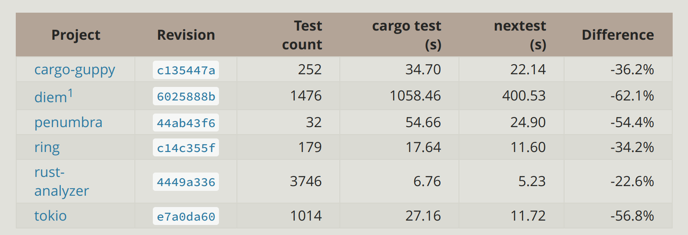
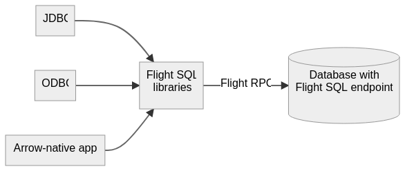
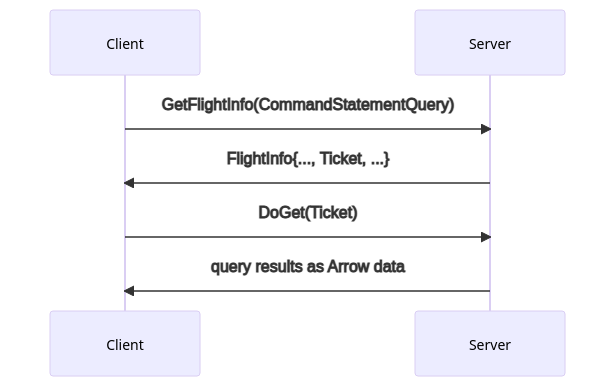

- OpenDAL benchmark 数据
collapsed:: true
	- ```
	  Benchmarking s3/bench_read/05e6415b-73ce-42a3-b75c-37de4ae34243: Collecting 100 samples in estimate                                                                                                   s3/bench_read/05e6415b-73ce-42a3-b75c-37de4ae34243
	                          time:   [16.462 ms 16.763 ms 17.074 ms]
	                          thrpt:  [937.08 MiB/s 954.50 MiB/s 971.94 MiB/s]
	  Found 1 outliers among 100 measurements (1.00%)
	    1 (1.00%) high mild
	  Benchmarking s3/bench_seekable_read/05e6415b-73ce-42a3-b75c-37de4ae34243: Collecting 100 samples in                                                                                                   s3/bench_seekable_read/05e6415b-73ce-42a3-b75c-37de4ae34243
	                          time:   [11.966 ms 12.099 ms 12.233 ms]
	                          thrpt:  [1.2773 GiB/s 1.2914 GiB/s 1.3058 GiB/s]
	  
	  ```
	- fs-before
		- ```
		  Benchmarking fs/bench_read/64226295-b7a7-416e-94ce-666ac3ab037b: Collecting 100 samples in estimate                                                                                                   fs/bench_read/64226295-b7a7-416e-94ce-666ac3ab037b
		                          time:   [16.060 ms 17.109 ms 18.124 ms]
		                          thrpt:  [882.82 MiB/s 935.20 MiB/s 996.24 MiB/s]
		  Benchmarking fs/bench_seekable_read/64226295-b7a7-416e-94ce-666ac3ab037b: Collecting 100 samples in                                                                                                   fs/bench_seekable_read/64226295-b7a7-416e-94ce-666ac3ab037b
		                          time:   [14.779 ms 14.857 ms 14.938 ms]
		                          thrpt:  [1.0460 GiB/s 1.0517 GiB/s 1.0572 GiB/s]
		  
		  ```
	- fs-after
		- ```rust
		  Benchmarking fs/bench_read/df531bc7-54c8-43b6-b412-e4f7b9589876: Collecting 100 samples in estimate                                                                                                   fs/bench_read/df531bc7-54c8-43b6-b412-e4f7b9589876
		                          time:   [14.654 ms 15.452 ms 16.273 ms]
		                          thrpt:  [983.20 MiB/s 1.0112 GiB/s 1.0663 GiB/s]
		  Found 22 outliers among 100 measurements (22.00%)
		    22 (22.00%) high severe
		  Benchmarking fs/bench_seekable_read/df531bc7-54c8-43b6-b412-e4f7b9589876: Collecting 100 samples in                                                                                                   fs/bench_seekable_read/df531bc7-54c8-43b6-b412-e4f7b9589876
		                          time:   [5.5589 ms 5.5825 ms 5.6076 ms]
		                          thrpt:  [2.7864 GiB/s 2.7989 GiB/s 2.8108 GiB/s]
		  
		  ```
	- s3-before
		- ```
		  Benchmarking s3/bench_read/72025a81-a4b6-46dc-b485-8d875d23c3a5: Collecting 100 samples in estimate                                                                                                   s3/bench_read/72025a81-a4b6-46dc-b485-8d875d23c3a5
		                          time:   [4.8315 ms 4.9331 ms 5.0403 ms]
		                          thrpt:  [3.1000 GiB/s 3.1674 GiB/s 3.2340 GiB/s]
		  Found 5 outliers among 100 measurements (5.00%)
		    5 (5.00%) high mild
		  Benchmarking s3/bench_seekable_read/72025a81-a4b6-46dc-b485-8d875d23c3a5: Collecting 100 samples in                                                                                                   s3/bench_seekable_read/72025a81-a4b6-46dc-b485-8d875d23c3a5
		                          time:   [16.246 ms 16.539 ms 16.833 ms]
		                          thrpt:  [950.52 MiB/s 967.39 MiB/s 984.84 MiB/s]
		  
		  ```
	- s3-after
		- ```
		  Benchmarking s3/bench_read/6971c464-15f7-48d6-b69c-c8abc7774802: Collecting 100 samples in estimate                                                                                                   s3/bench_read/6971c464-15f7-48d6-b69c-c8abc7774802
		                          time:   [4.4222 ms 4.5685 ms 4.7181 ms]
		                          thrpt:  [3.3117 GiB/s 3.4202 GiB/s 3.5333 GiB/s]
		  Benchmarking s3/bench_seekable_read/6971c464-15f7-48d6-b69c-c8abc7774802: Collecting 100 samples in                                                                                                   s3/bench_seekable_read/6971c464-15f7-48d6-b69c-c8abc7774802
		                          time:   [5.5598 ms 5.7174 ms 5.8691 ms]
		                          thrpt:  [2.6622 GiB/s 2.7329 GiB/s 2.8103 GiB/s]
		  
		  ```
- [cargo-nextest](https://nexte.st/) #read
	- https://nexte.st/book/benchmarks.html
	- 
	- 一个新的测试执行框架，看起来跑的比 libtest 要快不少
	- 可以考虑试试
- [Introducing Apache Arrow Flight SQL: Accelerating Database Access](https://arrow.apache.org/blog/2022/02/16/introducing-arrow-flight-sql/) #read
	- [[Apache Flight SQL]] 是基于 [[Apache Flight RPC]] 开发 client-server 协议
	- 基于 [[Apache Arrow]] 开发，在跟 Arrow native 的数据库交互时可以不需要进行数据转换
	- 
	- 执行 Query 的交互如图
		- 
	- 如果能够减少数据转换的话，对一些特别大的 Query 看起来会很有帮助
- [Rust Survey 2021 Results](https://blog.rust-lang.org/2022/02/15/Rust-Survey-2021.html) #read
	- [[Rust]] 2021 年度调查结果
- [Go’s Version Control History](https://research.swtch.com/govcs) #read
	- Go 历史的一个小故事
- [Crates.io Index Snapshot Branches Moving](https://blog.rust-lang.org/2022/02/14/crates-io-snapshot-branches.html) #read
	- crates.io 的 index 会把 snapshot 分支移动到别的 repo 上
	- HTTP API 势在必行啊 - -
- [Async Rust in 2022](https://blog.rust-lang.org/inside-rust/2022/02/03/async-in-2022.html) #read
	- Async [[Rust]] 一直处于能用，但不是很好用的状态
	- 在 2022 年，Rust 语言组计划从多个层面改进 Async Rust 的体验
		- [async fundamentals](https://rust-lang.github.io/async-fundamentals-initiative/)
			- static async fn in trait
			- dyn async fn in trait
			- async drop
			- async closures
		- [Async iteration](https://estebank.github.io/rust-iterator-item-syntax.html)
			- generators and async generators
			- ```rust
			  fn merge_overlapping_intervals(input: impl Iterator<Interval>) -> impl Iterator<Item = Interval> {
			      let mut prev = input.next()?;
			      for i in input {
			          if prev.overlaps(&i) {
			              prev = prev.merge(&i);
			          } else {
			              yield prev;
			              prev = i;
			          }
			      }
			      yield prev;
			  }
			  ```
		- [Portability](https://www.ncameron.org/blog/portable-and-interoperable-async-rust/)
			- 这也是我目前最关注的方向： [[Rust/RFCs/Async IO in std]]
			- 标准化 `AsyncRead` & `AsyncWrite`，让 runtime 可以无缝切换
		- [Polish](https://rust-lang.github.io/wg-async/vision/roadmap/polish.html)
			- 改进使用体验，比如减少 ICE
		- Tooling
			- 解决 Async Rust 中工具相关的问题，比如 [async-crashdump-debugging-initiative](https://github.com/rust-lang/async-crashdump-debugging-initiative)
	- 期待这些工作今年可以有一些进展
- [Akamai To Acquire Linode to Provide Businesses with a Developer-friendly and Massively-distributed Platform to Build, Run and Secure Applications](https://www.linode.com/press-release/akamai-to-acquire-linode/) #read
	- 震惊，[[Linode]] 居然被收购了
	- 当年风头正劲，可惜后来泯然众人矣
- [How to become a better writer?](https://twitter.com/semrush/status/1493861214451085314) #read
	- 
- [Tips for Faster Rust Compile Times](https://endler.dev/2020/rust-compile-times/) #read
	- 一些加速 Rust 编译的优化
- [Fast Rust Builds](https://matklad.github.io/2021/09/04/fast-rust-builds.html) #read
	- 跟上一篇文章差不多
-