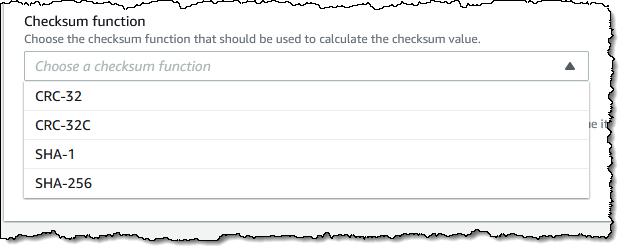

- [Async: What is blocking?](https://ryhl.io/blog/async-what-is-blocking/) #read
	- 关于 Async 的一篇介绍文章
	- 最有价值的信息是
		- > Async code should never spend a long time without reaching an .await.
- [How to speed up the Rust compiler in 2022](https://nnethercote.github.io/2022/02/25/how-to-speed-up-the-rust-compiler-in-2022.html) #read
	- 作者是 Rust 编译器的开发者，本文总结了过去一段时间为了改进编译器速度做出的一些改进和未来的可能方向
- [New – Additional Checksum Algorithms for Amazon S3](https://aws.amazon.com/blogs/aws/new-additional-checksum-algorithms-for-amazon-s3/) #read
	- [[AWS S3]] 支持新的 checksum 算法了
	- 
	- 用户可以不需要自行计算 SHA-256，能减少特定的负载下的 io 开销
	-