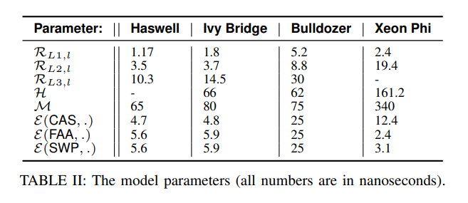

- [[OpenDAL Path 处理设计]]
-
- [Unbuffered I/O Can Make Your Rust Programs Much Slower](https://era.co/blog/unbuffered-io-slows-rust-programs) #read
	- syscall 开销很大，如果每次 syscall 都只 read 几个 byte，那性能肯定就上不来
	- Buffered IO 的意义在于每次 fill_buf 的时候都会读一大块数据上来(比如 8k），就能避免 syscall 的开销
- [How much expensive is Arc vs Rc?](https://users.rust-lang.org/t/how-much-expensive-is-arc-vs-rc/48756) #read
	- 我们都知道 Arc 有开销，但是开销到底有多大？这个研究给出了一个量化的答案
	- [[Evaluating the Cost of Atomic Operations on Modern Architectures]]
		- 
- [殊途同归](https://expye.com/research-product.html) #read
	- > 好的设计往往不是对一个问题提出性能最高的解决方案，而是一个好的抽象层：我们可以在上面实现各种可能，而且能够把整个体系的复杂性保持了可维护的量级。
- [42 things I learned from building a production database](https://maheshba.bitbucket.io/blog/2021/10/19/42Things.html) #read
	- [[Log structured protocols in Delos]] 的作者总结了一些开发生产级数据库的经验，很有借鉴意义
	- To Customers
		- 第一条：Keep your customers happy，满足用户的需求是第一位的
		- 后面还聊了一些公司内部的沟通技巧，直接上门问需求是最直接的
			- 更加根本的做法是读他们的代码，看他们是怎么用的
			- 开发 lib 的时候可以用到这样的技巧
	- To Project Management
		- > A road-map is a means, not an end.
		- >  Keep track of how long similar features took in other projects in your space and use this as evidence for task difficulty estimates (e.g., “feature X took three years in system Y; it’s not a one-half job for one IC.”).
	- To Design
		- 对 API 保守，对实现自由
		- 大版本变更时提供迁移工具
		- > Design as a team; implement as individuals.
		- > Late-bind to designs: encourage the team to think about the entire design space without committing to a particular point solution.
			- 在一定的时候回头重新考虑整体的设计
		-