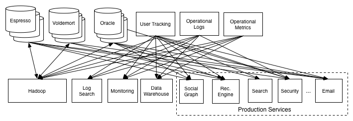
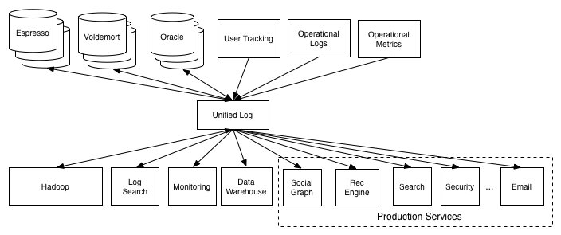
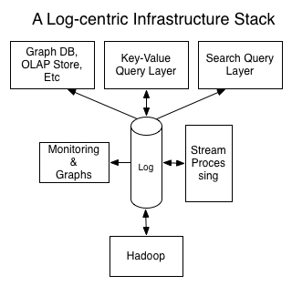

- 写完了 [[2022-11: 新轮子 reqsign]]
- 配置 [[1Password]] SSH Agent
	- 需要配置 System Auth
		- https://support.1password.com/system-authentication-linux/
	- 哇，好 cool
		- 
	- 
	- 真不错，配置起来很丝滑，完全没有需要记录的地方。。。
- [The Log: What every software engineer should know about real-time data's unifying abstraction](https://engineering.linkedin.com/distributed-systems/log-what-every-software-engineer-should-know-about-real-time-datas-unifying) #read
  collapsed:: true
	- 经典长文，append only log 是一个分布式系统中经常使用的抽象，它能够解决两个非常关键的问题
		- ordering changes
		- distributing data
	- > If two identical, deterministic processes begin in the same state and get the same inputs in the same order, they will produce the same output and end in the same state.
	- 大型的数据服务还经常需要处理数据集成的需求，统一 log 抽象能把这件事情变得更简单
		- from
			- 
		- to
			- 
	- The place of the log in system architecture
		- Handle data consistency (whether eventual or immediate) by sequencing concurrent updates to nodes
		- Provide data replication between nodes
		- Provide "commit" semantics to the writer (i.e. acknowledging only when your write guaranteed not to be lost)
		- Provide the external data subscription feed from the system
		  Provide the capability to restore failed replicas that lost their data or bootstrap new replicas
		- Handle rebalancing of data between nodes.
	- 
- [Dropping cache didn’t drop cache](https://blog.twitter.com/engineering/en_us/topics/open-source/2021/dropping-cache-didnt-drop-cache) #read
	- 文章的组织非常不错，可以借鉴
- [Git History](https://github.githistory.xyz/) #read
	- 非常好玩的插件，可以轻松看到当前文件的历史变化
- [hyper’s Vision](https://seanmonstar.com/post/678179333918097408/hypers-vision) #read
	- hyper 终于准备发布 1.0 了，有空的时候可以看看能做些什么
- [Implementing Node.js URL parser in WebAssembly with Rust](https://www.yagiz.co/implementing-node-js-url-parser-in-webassembly-with-rust/) #read
	-