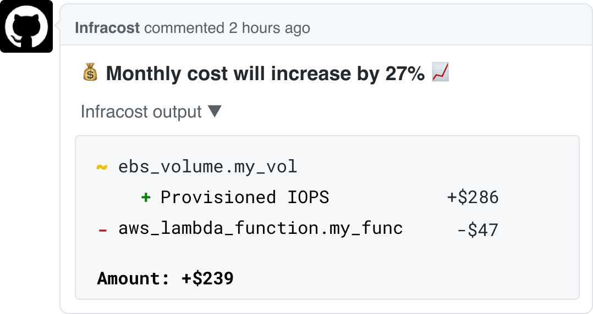

- Infracost
	- https://www.infracost.io
	- Love your cloud bill!
	- {:height 404, :width 746}
	- 国外真的是什么 SaaS 都有啊- -
- [[reqsign]] 发布 0.0.2
	- 支持了 azblob
- 今天完整过了一遍 chrono 与 libc `localime_r` 相关的爱恨情仇
	- 最后决定用 `time` 了- -
- [[time-rs/time]] 的时间格式化语法
	- 最开始觉得非常诡异，熟悉了之后感觉还挺舒服的，非常接近书面语，完全没有背景知识也能够理解格式
		- ISO8601 的简化形式
			- `[year][month][day]T[hour][minute][second]Z`
			- -> `20220313T072004Z`
	- 以表达 HTTP Date 为例
		- ```rust
		  format_description!(
		      "[weekday repr:short], [day] [month repr:short] [year] [hour]:[minute]:[second] GMT"
		  );
		  ```
			- `weekday`， `day`，`year` 都用来表示时间中某个组成部分
			- 然后每个 Component 可以选择一些特定的表示方式
				- 比如 `weekday` 可以通过 `repr` 来配置可用的表示方式：`[weekday repr:short]`
					- `repr:short` -> `Sun`
					- `repr:long` -> `Sunday`
					- `repr:monday` -> 数字表示，monday 是第一天
					- `repr:sunday` -> 数字表示，sunday 是第一天
			- 在 `[xxx]` 之外的字符都会被当作 white space 原样保留
	- 为了最大程度的兼容各种不同的时间格式，在解析时候最好使用 time 提供的 well_known 格式
		- ```rust
		  OffsetDateTime::parse(s, &Rfc2822)
		  ```
		- 根据 RFC2822 标准
			- `Tue, 1 Jul 2003 10:52:37 +0200`
			- `Tue, 01 Jul 2003 10:52:37 +0200`
			- `Tue, 1 Jul 2003 10:52:37 GMT`
		- 都是合法的时间字符串，如果用前面的 HTTP Date 来解析就很容易出错
			- 还要考虑时间精度的问题，到秒，微妙，毫米还是纳米
	- 参考资料
		- [Format description](https://time-rs.github.io/book/api/format-description.html)