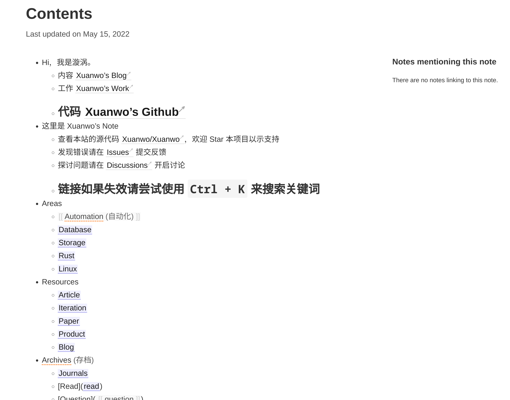

- Logseq Publish 的替代品
	- https://github.com/TuanManhCao/digital-garden
	- https://github.com/jackyzha0/quartz
	- https://github.com/binnyva/gatsby-garden/
	- https://github.com/aengusmcmillin/gatsby-theme-brain
	- https://github.com/mathieudutour/gatsby-digital-garden/
	-
- 或许可以自己开发一个 rust 工具来解析 logseq 的 Notes
	- 先不用考虑支持 query 的问题，把所有的 note 都变成一个标准的 markdown，然后就可以用来托管了
	- 参考
		- https://jekyll-garden.github.io/posts/features
		- https://github.com/maximevaillancourt/digital-garden-jekyll-template
			- 这个感觉工作的还不错
				- 只需要对导出的内容做一些轻微调整
			- 