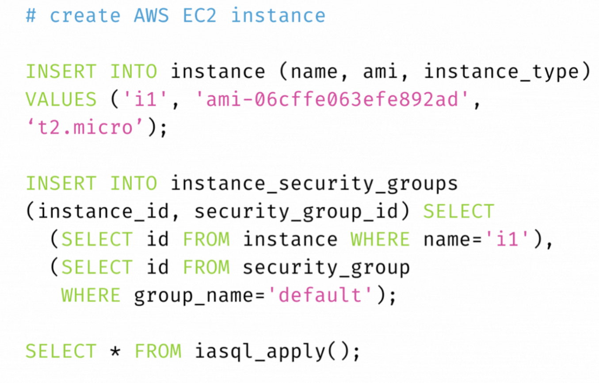

- [How to build openssl-sys crate for musl in Rust](https://qiita.com/liubin/items/6c94f0b61f746c08b74c) #read
- [WEBASSEMBLY 2.0 FIRST PUBLIC WORKING DRAFTS](https://www.w3.org/blog/news/archives/9509) #read
- [Infrastructure as data in PostgreSQL](https://iasql.com/) #read
	- 挺有意思的，IaC in SQL
	- 
- [Is The Modern Data Warehouse Broken? ](https://www.montecarlodata.com/blog-is-the-modern-data-warehouse-broken/) #read
	- immutable data warehouse
- [RisingWave 中的状态管理](https://blog.zhuangty.com/state-management-in-risingwave) #read
- [Quick tip: the #[cfg_attr] attribute](https://chrismorgan.info/blog/rust-cfg_attr/) #read
-
- {{embed [[Rust/Attributes/cfg_attr]]}}