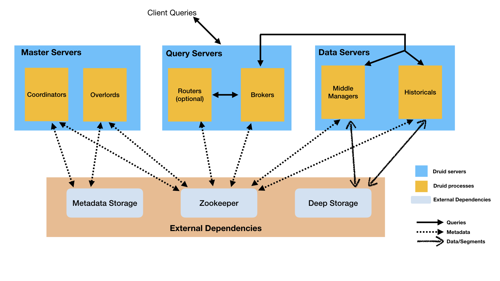

alias:: [[Druid]]
language:: [[Java]]
type:: [[Database]]
category:: [[OLAP]], [[SQL]]

- https://druid.apache.org/
-
- Apache Druid is a real-time database to power modern analytics applications.
-
- 整体架构
	- 
-
- 主要特征
	- 列式存储
	- 可扩展的分布式系统
	- 大规模并行处理
	- 实时或批量摄取
	- 自修复、自平衡、易于操作
	- 不会丢失数据的云原生容错架构
	- 用于快速过滤的索引
	- 基于时间的分区
	- 近似算法
	- 摄取时自动汇总聚合
-
- 推荐场景
	- 数据插入频率比较高，但较少更新数据
	- 大多数查询场景为聚合查询和分组查询（GroupBy），同时还有一定得检索与扫描查询
	- 将数据查询延迟目标定位100毫秒到几秒钟之间
	- 数据具有时间属性（Druid针对时间做了优化和设计）
	- 在多表场景下，每次查询仅命中一个大的分布式表，查询又可能命中多个较小的lookup表
	- 场景中包含高基维度数据列（例如URL，用户ID等），并且需要对其进行快速计数和排序
	- 需要从Kafka、HDFS、对象存储（如Amazon S3）中加载数据
-
- 不建议场景
	- 根据主键对现有数据进行低延迟更新操作。Druid支持流式插入，但不支持流式更新（更新操作是通过后台批处理作业完成）
	- 延迟不重要的离线数据系统
	- 场景中包括大连接（将一个大事实表连接到另一个大事实表），并且可以接受花费很长时间来完成这些查询
	-
- 参考资料
	- [Druid是什么](http://www.apache-druid.cn/GettingStarted/chapter-1.html)
-