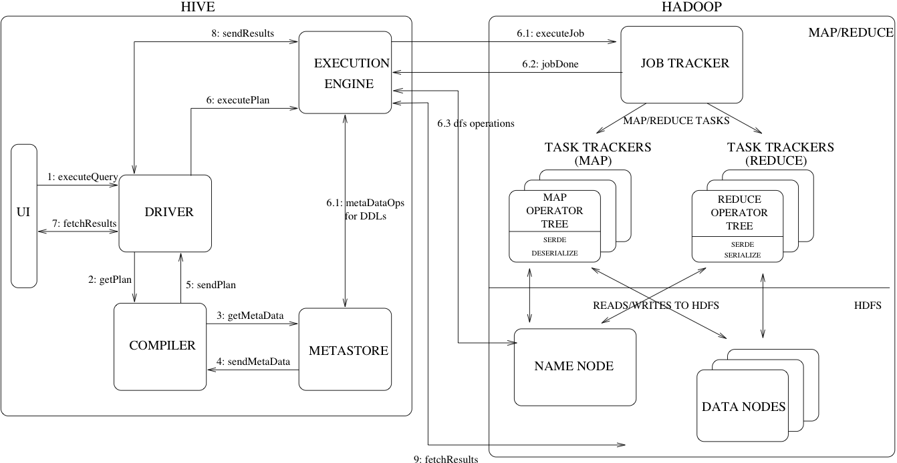
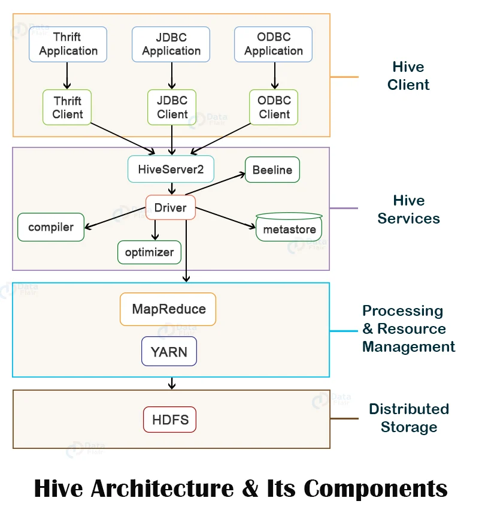

alias:: [[Hive]]
type:: [[Database]]
language:: [[Java]]
category:: [[OLAP]], [[SQL]]

- Apache Hive 是可实现大规模分析的分布式容错数据仓库系统。该数据仓库集中存储信息，您可以轻松对此类信息进行分析，从而做出明智的数据驱动决策。Hive 让用户可以利用 SQL 读取、写入和管理 PB 级数据。
-
- Hive 建立在 Apache Hadoop 基础之上，后者是一种开源框架，可被用于高效存储与处理大型数据集。因此，Hive 与 Hadoop 紧密集成，其设计可快速对 PB 级数据进行操作。Hive 的与众不同之处在于它可以利用 Apache Tez 或 MapReduce 通过类似于 SQL 的界面查询大型数据集。
-
- 如何工作？
	- Hive 旨在让非程序员熟悉 SQL，并使用名为 HiveQL 的类似于 SQL 的界面对 PB 级数据进行操作
	- Hive 会将 HiveQL 查询转换成在 Apache Hadoop 的分布式作业计划框架，亦即 Yet Another Resource Negotiator (YARN) 上运行的 MapReduce 或 Tez 作业。
	- 它会查询存储在分布式存储解决方案，如 Hadoop 分布式文件系统 (HDFS) 或 Amazon S3 当中的数据。
	- Hive 将其数据库和表元数据存储在元数据仓中，而元数据仓是一种可实现轻松数据提取和发现的基于数据库或文件的存储。
	- Hive 包含 HCatalog，它是从 Hive 元数据仓读取数据的表和存储管理层，可帮助 Hive、Apache Pig 和 MapReduce 之间的无缝集成
	- 通过元数据仓，HCatalog 允许 Pig 和 MapReduce 使用与 Hive 相同的数据结构，从而无需为每个引擎重新定义元数据仓。
-
- 架构图
	- 
	- 
-
- 常见应用场景
	- 简单容易上手：提供了类SQL查询语言HQL
	- 可扩展：为超大数据集设计了计算/扩展能力（MR作为计算引擎，HDFS作为存储系统）
	- 一般情况下不需要重启服务Hive可以自由的扩展集群的规模。
	- 提供统一的元数据管理
	- 延展性：Hive支持用户自定义函数，用户可以根据自己的需求来实现自己的函数
	- 容错：良好的容错性，节点出现问题SQL仍可完成执行
-
- 参考资料
	- [Apache Hive](https://hive.apache.org/)
	- [什么是 Apache Hive？](https://aws.amazon.com/cn/big-data/what-is-hive/)
	- [Apache Hive Design](https://cwiki.apache.org/confluence/display/hive/design)
	- [Apache Hive Architecture – Complete Working of Hive with Hadoop](https://data-flair.training/blogs/apache-hive-architecture/)
	- [Hive架构原理](https://zhuanlan.zhihu.com/p/87545980)