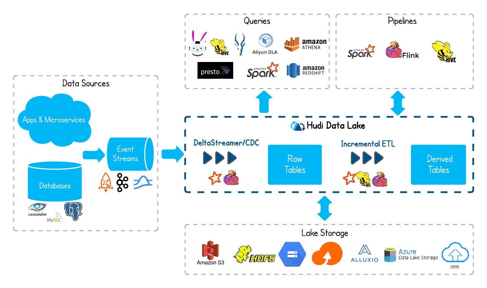
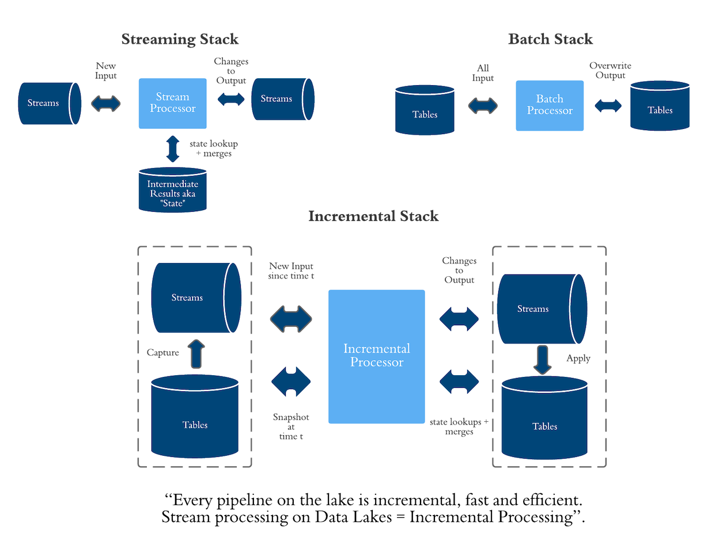
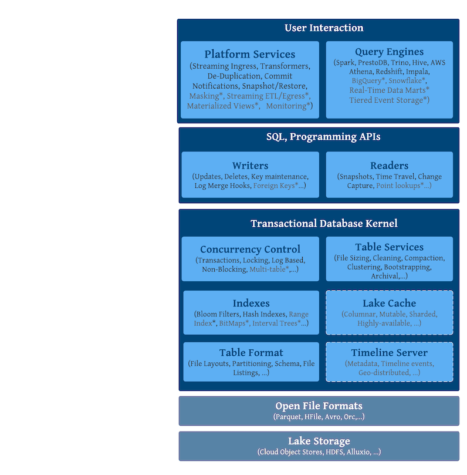

alias:: [[Hudi]]
language:: [[Java]]
type:: [[Database]]
category:: [[OLAP]], [[SQL]], [[Data Lake]]

- [[Uber]] 开源的数据湖框架
- https://hudi.apache.org/
-
- > 基于以上的两个坚实的“标准”，Hive 作为在 Hadoop 体系之上以 HDFS 为存储的大数据数仓的基础架构也一直是很多企业的不二选择，但天下却苦这套数仓架构久矣。
	- HDFS 复杂的架构
	- 高昂的成本
	- 冷热分层存储能力的缺失
	- 长久以来旧版本的 Hive 无法支持真正意义上的 Update/Delete 操作
-
- Apache Hudi (Hadoop Upserts Deletes and Incremental Processing) 是 Apache 基金会的顶级项目。它使得您能在 Hadoop 兼容的存储之上处理超大规模的数据，同时它还提供两种原语，使得除了经典的批处理之外，还可以在数据湖上进行流处理。
	- Update/Delete 操作：Hudi 使用细粒度的文件/记录级别索引来支持 Update/Delete 记录，同时还提供写操作的事务保证。查询会处理最后一个提交的快照，并基于此输出结果。
	- 变更流：Hudi 对获取数据变更提供了完备的支持，可以从给定的时间点获取给定表中已 Updated/Inserted/Deleted 的所有记录的增量流。
		- 变更流的具体实现是“增量视图”
-
- 
-
- 架构
	- 
	- Hudi Stack
		- {:height 816, :width 795}
-
- 参考资料
	- [Apache Hudi - The Data Lake Platform](https://hudi.apache.org/blog/2021/07/21/streaming-data-lake-platform/)
	- [开源数据湖存储框架 Apache Hudi 如何玩转增量处理](https://www.infoq.cn/article/cagidpfjbvcjhkjlsbhe)
	- [Apache Hudi - 初步了解](https://zhuanlan.zhihu.com/p/149706105)