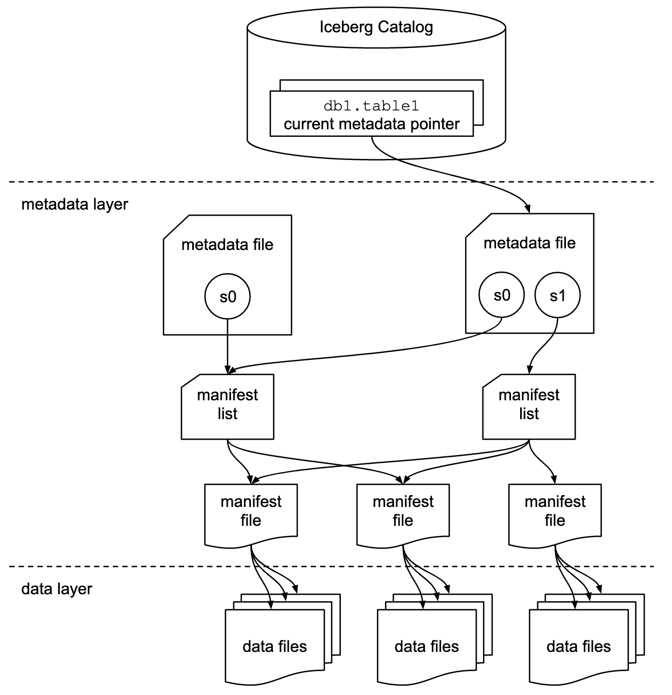

alias:: [[Iceberg]]

- Apache Iceberg is a new table format for storing large, slow-moving tabular data. It is designed to improve on the de-facto standard table layout built into Hive, Trino, and Spark.
-
- https://github.com/apache/iceberg
-
- Format
	- https://iceberg.apache.org/spec/
	- 