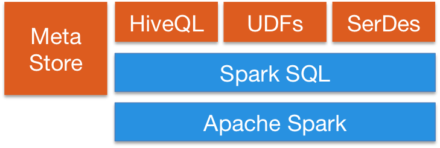
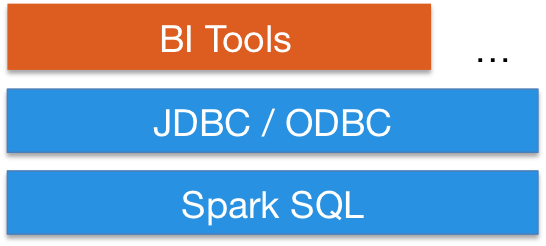

title:: Apache Spark/SQL
alias:: [[Spark SQL]]

- https://spark.apache.org/sql/
-
- Spark SQL is Apache Spark's module for working with structured data.
-
- 特性
	- Integrated
		- Seamlessly mix SQL queries with Spark programs.
		- ```python
		  results = spark.sql(
		    "SELECT * FROM people")
		  names = results.map(lambda p: p.name)
		  ```
	- Uniform data access
		- Connect to any data source the same way.
		- ```python
		  spark.read.json("s3n://...")
		    .registerTempTable("json")
		  results = spark.sql(
		    """SELECT *
		       FROM people
		       JOIN json ...""")
		  ```
	- Hive integration
		- Run SQL or HiveQL queries on existing warehouses.
		- 
	- Standard connectivity
		- Connect through JDBC or ODBC.
		- 
-
- 参考资料
	- [Spark SQL](https://spark.apache.org/sql/)