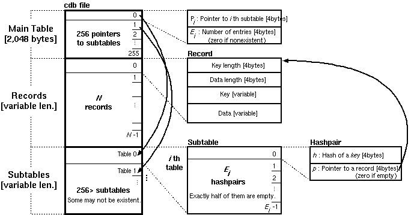

- 常见实现
	- https://cr.yp.to/cdb.html
	- [TinyCDB - a Constant DataBase](http://www.corpit.ru/mjt/tinycdb.html)
	- SSTable format 也可以被作用 constant database (write-once sorted map files)
		- 比如 [mtbl](https://github.com/farsightsec/mtbl)
			- > An SSTable is a file containing an immutable mapping of keys to values. Keys are stored in sorted order, with an index at the end of the file allowing keys to be located quickly.
		- [[LakeFS]] 的 Graveler
			- https://github.com/treeverse/lakeFS/tree/master/pkg/graveler
- 参考资料
	- [Constant Database (cdb) Internals](https://www.unixuser.org/~euske/doc/cdbinternals/index.html)
		- 