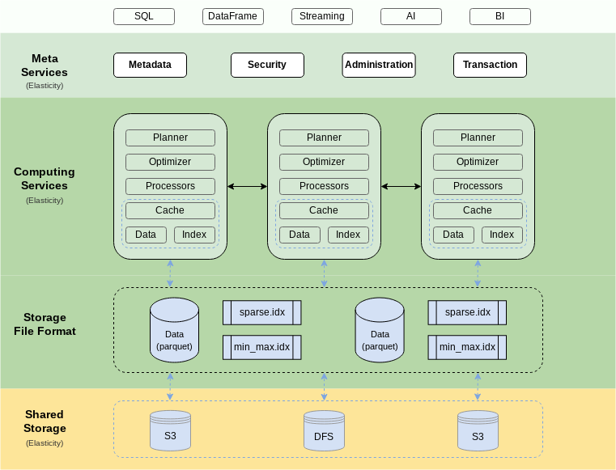

- 确定一下主题？要分享什么呢？听众会有什么样的收获？
	- 如何基于对象存储来开发数据库？好处与坏处？踩坑？
-
- 先罗列一下可能可以讲的主题，然后再选择主干吧
	- 数据仓库介绍？
		- 要不要介绍 [[Hive]]？
		- Lambda？Kappa？
		- Delta Lake？
		- Apache Hudi?
		- Apache [[Iceberg]]？
		- [[Snowflake]]
			- 可能需要再读一读 snowflake 的 paper
		- AWS Redshift
		- Azure Data Warehouse
			- Azure Databricks
		- Google BigQuery
	- [[Databend]] 整体架构
		- meta + query
		- 
	- 存储层需要做什么
		- 数据压缩
	- 技术选型考虑
		- 为什么没有自研存储？
		- 为什么没有使用 [[Rocksdb]] 等方案？
		- 存算分离？
		- 对象存储的简单介绍
			- 本次分享应该更偏使用者，技术细节上是否不用介绍太多，主要围绕功能展开？
	- 存储层设计
		- FUSE Engine
		- 存储层支持
		- 自动分区/分片
		- time travel / data sharing
	- 功能：COPY/STAGE
	- 未来规划
-
- 分享内容
	- [[Databend]] 介绍？
		- 大多数人对数仓和 [[Databend]] 可能没有概念，需要展开介绍
			- 需要再介绍一下 [[Databend]] 的特性和差异
		- 还需要介绍 [[Snowflake]]？
			- 可能首先介绍 [[Snowflake]]？
	- How we build [[Databend]]？
		- 2021 年，[[OLAP]] 领域有哪些选择？
			- [[Snowflake]] / [[Google BigQuery]] / [[AWS Redshift]]
				- 商业产品，付费高昂，供应商锁定
			- [[ClickHouse]]
				- 单机引擎，需要改造以适应大规模数据场景
			- [[Hadoop]] 生态
				- [[Hive]] / [[Hudi]]  / [[Iceberg]] / [[Impala]] / [[Spark SQL]] / [[Flink SQL]] / [[Druid]]
				- 臃肿，复杂，笨重，部署难，维护麻烦
				- 现在系统对时效性要求高，更新困难
			- [[Presto]] / [[Trino]]
				- 并不是一个真正的 DBMS，只是一个 Query Engine，纯内存？
					- 需要补充更多的资料
		- 在 2021 年，我们有什么？
			- [[Rust]]
			- Cloud Serivces： [[AWS]]，GCP，[[Azure]]，Aliyun
			- [[Arrow]] / [[Parquet]]
		- 愿景
			- A Modern Real-Time Data Processing & Analytics DBMS with Cloud-Native Architecture
			- 
		- Goal
			- Modern
			- Real-Time
			- [[OLAP]]
			- Cloud-Native
		-
	-
-
- 参考资料
	- [Snowflake：数据仓库的终极形态？](https://zhuanlan.zhihu.com/p/54439354)
	  collapsed:: true
		- > 关于微软对snowflake的支持，我觉得可以从三个方面细谈。
			- > 第一，云服务商业模式很简单，就是靠scale来吸引consumption。所以对微软来说，提供对snowflake的支持虽然从某种意义上在“打击”自家的数据服务，但是反过来想，snowflake的客户可以把数据放在Azure上了。这个逻辑就是，不管你用什么解决方案，只要你的数据在我手里，我就支持。
			- > 第二，未来趋势是multi-cloud，也就是说尽量不把鸡蛋放一个篮子里，用来分摊技术和商业的风险。Multi-cloud solution关键就是要easy to migrate，如果微软只想着防守，那客户就永远不能从AWS转到Azure上，相反，提供Snowflake on Azure，就是给AWS客户转化的机会。有机会可以看一下上周snowflake的新一轮融资，Salesforce领投，更是坚定了data sharing的战略路线。
			- > 第三，从战略上讲不仅要培养好的伙伴，更要培养好的竞争对手。Snowflake还不明显，Azure Databricks才是最有意思的案例。Azure Databricks已经是Azure first tier service 很多人甚至以为Databricks就是微软的。云计算就是让客户怎么舒服怎么来，如果有好的技术，平台就应该吸引。
	- [数据仓库技术选型之 ClickHouse|清风](https://www.modb.pro/db/197700)
	- [从数仓到数据中台，谈技术选型最优解](https://www.infoq.cn/article/jqr7zoiucoqi0skgiagb)
	- [Presto 优缺点](https://zhuanlan.zhihu.com/p/93711386)
	- [即席查询引擎对比：我为什么选择Presto](https://cloud.tencent.com/developer/article/1877751)
	- [How we build TiDB](https://en.pingcap.com/blog/how-we-build-tidb/)