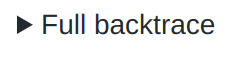
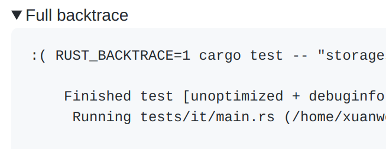

type:: [[Product]]
features:: [[Git Host]]

-
- 原来 Github 可以直接在 PR 界面上切换 base 不需要重新开 PR
-
- Github 点击展示更多内容
	- ```markdown
	  <details>
	    <summary>Lalala</summary>
	    Any markdown here
	  </details>
	  ```
	- 实际的用例参见: https://github.com/datafuselabs/databend/pull/4081#issuecomment-1034590367
		- 
		- {:height 260, :width 653}