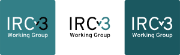

- IRC 的现代化
	- Open, extensible, feature-rich chat, proven through years of use.
-
- 
-
- IRC / Internet Relay Chat 是个历史悠久的协议，从 1988 年传承至今。但是对于现代通讯来说，IRC 缺乏很多必须的特性，比如多媒体支持，历史记录等等。
-
- libera.chat 带头冲锋开始了 IRCv3 的设计工作： https://ircv3.net/
-
- IRCv3 计划实现如下特性
	- 使用 SASL 标准话帐户登陆，加快注册和登陆时间
	- 提供更多的帐号信息，使得客户端可以开发更高级的功能
	- 在消息中追加可选的 metadata，支持扩展开发 (不再是纯文本)
	- 让用户知道其他用户何时离开
	- 显示收到消息的实际时间
	- 相关的消息分组
-
- 目前正在进行的工作
	- 帐号注册，认证
	- 标准化 client 获取/访问/查看历史记录的行为
	- 允许 client 自动检测，切换，保持安全链接
	- 支持 utf-8 昵称和频道名
	- 图形化界面支持展示用户头像
-
- 参与 IRCv3 的项目/组织包括
	- https://irssi.org/
	- https://weechat.org/
	- https://hexchat.github.io/
	- ...
- 体感上主流的 irc client 都参与进来了
-
- Specs: https://ircv3.net/wg