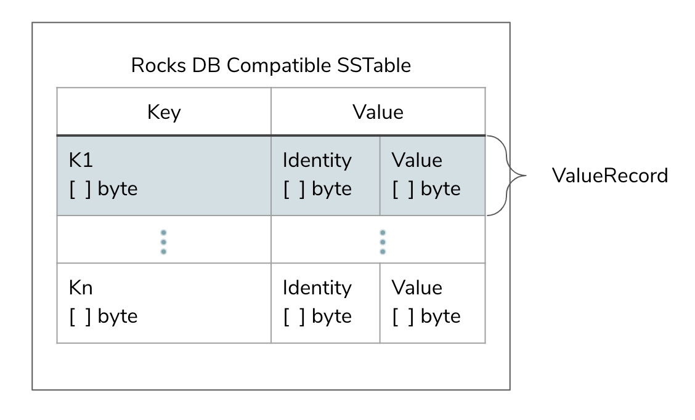
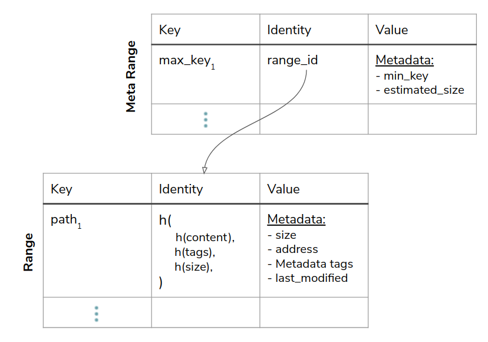

- Git-like capabilities for your object storage
- https://github.com/treeverse/lakeFS
-
- [Data Model](https://docs.lakefs.io/understand/data-model.html)
	- SSTables were chosen as a storage format for 3 major reasons
		- Extremely high read throughput on modern hardware
		- Being a known storage format means it’s relatively easy to generate and consume
		- The SSTable format supports delta encoding for keys which makes them very space efficient for data lakes where many keys share the same common prefixes.
	- SSTable File Format (“Graveler File”)
		- https://github.com/treeverse/lakeFS/tree/master/pkg/graveler
		- 
		- How to build commit?
			- 
		- Layout
			- ```text
			  <lakefs root>
			      _lakefs/
			          <range hash1>
			          <range hash2>
			          <range hashN>
			          ...
			          <metarange hash1>
			          <metarange hash2>
			          <metarange hashN>
			          ...
			      <data object hash1>
			      <data object hash2>
			      <data object hashN>
			      ...
			  ```
	- Representing references and uncommitted data
		- > References and uncommitted data are currently stored on PostgreSQL for its strong consistency and transactional guarantees.
		- > In the future we plan on eliminating the need for an RDBMS by embedding Raft to replicate these writes across a cluster of machines, with the data itself being stored in RocksDB. To make operations easier, the replicated RocksDB database will be periodically snapshotted to the underlying object store.
- [Roadmap](https://docs.lakefs.io/understand/roadmap.html)