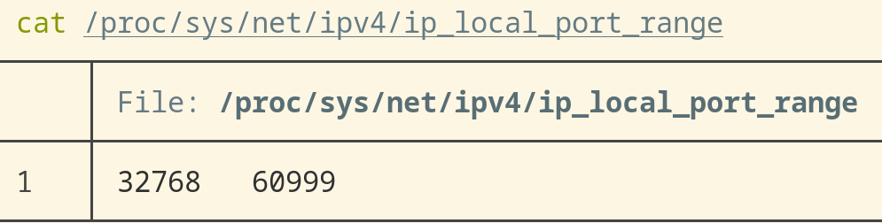

title:: Linux/sys/net

- `ip_local_port_range`
	- Linux 会在 `/proc/sys/net/ipv4/ip_local_port_range` 中维护 local port range
	- 如果应用尝试 bind `127.0.0.1:0` 的话，就会在这个范围里找一个可用端口
	- 
	- 参考资料
		- [The ip_local_port_range parameters](https://tldp.org/LDP/solrhe/Securing-Optimizing-Linux-RH-Edition-v1.3/chap6sec70.html)
		- [What's the easiest way to find an unused local port?](https://unix.stackexchange.com/questions/55913/whats-the-easiest-way-to-find-an-unused-local-port)