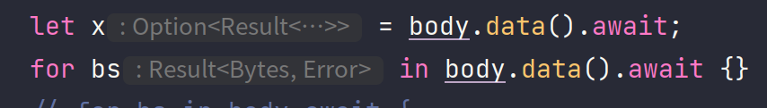

- ```rust
  async fn read(&self, w: BoxedAsyncWrite, args: &OpRead) -> Result<usize>
  ```
-
- 其实可以考虑底层支持多种 API
	- ```rust
	  async fn read(&self, w: BoxedAsyncWrite, args: &OpRead) -> Result<usize>
	  ```
	- ```rust
	  async fn read(&self, sender: tokio::sync::mpsc::Sender<bytes>, args: &OpRead) -> Result<usize>
	  ```
	- 这样会导致 service 实现的复杂度高很多
		- 需要 bench 一下 channel 发送 bytes 的开销到底有多大
-
- Reader2 性能
	- 基础(当前的main)
		- ```rust
		  s3/read                 time:   [4.9304 ms 5.0706 ms 5.2110 ms]
		                          thrpt:  [2.9985 GiB/s 3.0815 GiB/s 3.1691 GiB/s]
		                   change:
		                          time:   [-14.078% -10.663% -6.5827%] (p = 0.00 < 0.05)
		                          thrpt:  [+7.0466% +11.936% +16.384%]
		                          Performance has improved.
		  Found 1 outliers among 100 measurements (1.00%)
		    1 (1.00%) high mild
		  s3/read2                time:   [5.9507 ms 6.0480 ms 6.1428 ms]
		                          thrpt:  [2.5436 GiB/s 2.5835 GiB/s 2.6257 GiB/s]
		                   change:
		                          time:   [+2.4073% +6.0430% +9.8358%] (p = 0.00 < 0.05)
		                          thrpt:  [-8.9550% -5.6986% -2.3507%]
		                          Performance has regressed.
		  Found 2 outliers among 100 measurements (2.00%)
		    2 (2.00%) low mild
		  
		  fs not set, ignore
		  s3_parallel/parallel_range_read_2
		                          time:   [3.2178 ms 3.2730 ms 3.3382 ms]
		                          thrpt:  [4.6806 GiB/s 4.7739 GiB/s 4.8557 GiB/s]
		                   change:
		                          time:   [-3.6668% -0.7349% +2.3554%] (p = 0.64 > 0.05)
		                          thrpt:  [-2.3012% +0.7404% +3.8064%]
		                          No change in performance detected.
		  Found 1 outliers among 100 measurements (1.00%)
		    1 (1.00%) high severe
		  s3_parallel/parallel_range_read_4
		                          time:   [4.4657 ms 4.5850 ms 4.7094 ms]
		                          thrpt:  [6.6357 GiB/s 6.8158 GiB/s 6.9978 GiB/s]
		                   change:
		                          time:   [+6.1255% +9.6108% +13.633%] (p = 0.00 < 0.05)
		                          thrpt:  [-11.998% -8.7681% -5.7719%]
		                          Performance has regressed.
		  s3_parallel/parallel_range_read_8
		                          time:   [6.3954 ms 6.6064 ms 6.8245 ms]
		                          thrpt:  [9.1581 GiB/s 9.4605 GiB/s 9.7726 GiB/s]
		                   change:
		                          time:   [-25.968% -21.143% -15.792%] (p = 0.00 < 0.05)
		                          thrpt:  [+18.754% +26.813% +35.076%]
		                          Performance has improved.
		  Found 3 outliers among 100 measurements (3.00%)
		    3 (3.00%) high mild
		  s3_parallel/parallel_range_read_16
		                          time:   [17.556 ms 18.165 ms 18.795 ms]
		                          thrpt:  [6.6508 GiB/s 6.8813 GiB/s 7.1200 GiB/s]
		                   change:
		                          time:   [-19.272% -14.890% -10.318%] (p = 0.00 < 0.05)
		                          thrpt:  [+11.505% +17.496% +23.873%]
		                          Performance has improved.
		  Found 3 outliers among 100 measurements (3.00%)
		    3 (3.00%) high mild
		  
		  ```
	- 使用了一个内部的 channel
		- ```rust
		  s3/read2                time:   [5.7093 ms 5.7913 ms 5.8743 ms]
		                          thrpt:  [2.6599 GiB/s 2.6980 GiB/s 2.7368 GiB/s]
		                   change:
		                          time:   [-8.9355% -6.9789% -4.8184%] (p = 0.00 < 0.05)
		                          thrpt:  [+5.0623% +7.5025% +9.8122%]
		                          Performance has improved.
		  Found 2 outliers among 100 measurements (2.00%)
		    2 (2.00%) high mild
		  
		  fs not set, ignore
		  s3_parallel/parallel_range_read_2
		                          time:   [3.4875 ms 3.5802 ms 3.6754 ms]
		                          thrpt:  [4.2513 GiB/s 4.3643 GiB/s 4.4802 GiB/s]
		                   change:
		                          time:   [-19.928% -17.502% -14.545%] (p = 0.00 < 0.05)
		                          thrpt:  [+17.021% +21.215% +24.887%]
		                          Performance has improved.
		  Found 3 outliers among 100 measurements (3.00%)
		    3 (3.00%) high mild
		  s3_parallel/parallel_range_read_4
		                          time:   [4.5647 ms 4.7198 ms 4.8762 ms]
		                          thrpt:  [6.4087 GiB/s 6.6211 GiB/s 6.8460 GiB/s]
		                   change:
		                          time:   [-42.785% -40.591% -38.407%] (p = 0.00 < 0.05)
		                          thrpt:  [+62.357% +68.325% +74.780%]
		                          Performance has improved.
		  Found 1 outliers among 100 measurements (1.00%)
		    1 (1.00%) high mild
		  s3_parallel/parallel_range_read_8
		                          time:   [8.3315 ms 8.6573 ms 9.0001 ms]
		                          thrpt:  [6.9444 GiB/s 7.2194 GiB/s 7.5016 GiB/s]
		                   change:
		                          time:   [-56.363% -54.543% -52.529%] (p = 0.00 < 0.05)
		                          thrpt:  [+110.66% +119.99% +129.16%]
		                          Performance has improved.
		  s3_parallel/parallel_range_read_16
		                          time:   [21.719 ms 21.968 ms 22.212 ms]
		                          thrpt:  [5.6276 GiB/s 5.6900 GiB/s 5.7553 GiB/s]
		                   change:
		                          time:   [-46.328% -45.428% -44.540%] (p = 0.00 < 0.05)
		                          thrpt:  [+80.311% +83.244% +86.318%]
		                          Performance has improved.
		  
		  ```
	- 把 channel 的 buffer 数量加大
		- 有不同比例的性能提升
		- ```rust
		  s3/read2                time:   [5.5278 ms 5.7034 ms 5.8777 ms]
		                          thrpt:  [2.6583 GiB/s 2.7396 GiB/s 2.8266 GiB/s]
		                   change:
		                          time:   [-4.6765% -1.5186% +1.6649%] (p = 0.38 > 0.05)
		                          thrpt:  [-1.6377% +1.5420% +4.9059%]
		                          No change in performance detected.
		  
		  fs not set, ignore
		  s3_parallel/parallel_range_read_2
		                          time:   [3.2186 ms 3.2973 ms 3.3747 ms]
		                          thrpt:  [4.6301 GiB/s 4.7388 GiB/s 4.8546 GiB/s]
		                   change:
		                          time:   [-11.214% -7.9038% -4.7505%] (p = 0.00 < 0.05)
		                          thrpt:  [+4.9874% +8.5821% +12.630%]
		                          Performance has improved.
		  s3_parallel/parallel_range_read_4
		                          time:   [4.0911 ms 4.1829 ms 4.2774 ms]
		                          thrpt:  [7.3058 GiB/s 7.4708 GiB/s 7.6385 GiB/s]
		                   change:
		                          time:   [-14.840% -11.374% -7.7887%] (p = 0.00 < 0.05)
		                          thrpt:  [+8.4465% +12.833% +17.427%]
		                          Performance has improved.
		  Found 1 outliers among 100 measurements (1.00%)
		    1 (1.00%) high mild
		  s3_parallel/parallel_range_read_8
		                          time:   [7.9268 ms 8.3778 ms 8.8517 ms]
		                          thrpt:  [7.0608 GiB/s 7.4602 GiB/s 7.8847 GiB/s]
		                   change:
		                          time:   [-9.2036% -3.2287% +3.8163%] (p = 0.34 > 0.05)
		                          thrpt:  [-3.6760% +3.3364% +10.137%]
		                          No change in performance detected.
		  s3_parallel/parallel_range_read_16
		                          time:   [20.495 ms 21.343 ms 22.179 ms]
		                          thrpt:  [5.6359 GiB/s 5.8566 GiB/s 6.0990 GiB/s]
		                   change:
		                          time:   [-7.1786% -2.8451% +1.2502%] (p = 0.17 > 0.05)
		                          thrpt:  [-1.2347% +2.9284% +7.7338%]
		                          No change in performance detected.
		  
		  
		  ```
	- 在高并发的情况下看起来还是原来的实现更有优势
	- 感觉内部的实现好像没有什么搞头？
- ---
- Update at [[2022-03-20]]
	-
- 最底层的实现使用
	- ```rust
	  async fn read(&self, args: &OpRead, buf: tokio::io::ReadBuf)
	  ```
- 在这个基础上可以实现
	- ```rust
	  async fn read(&self, args: &OpRead, w: Box<dyn AsyncWrite>)
	  ```
- 以及
	- ```rust
	  async fn read(&self, args: &OpRead) -> Result<OwnedReader>
	  ```
	- OwnedReader 会提供两个接口
		- 一个是 async fetch ，另一个是 sync 的 buffer() -> &[u8]
		- 用户可以将 fetch 调度到 async runtime 上，而真正去读取数据的操作是完全同步的
	- 作为 AccessorReadExt ？
- 还是可以在外层包装 reader 的
-
- 感觉可以搞一搞
- read (`async fn read(&self, args: &OpRead) -> Result<BoxedAsyncReader>`)
	- ```rust
	  read_full/4.00 KiB      time:   [501.63 us 510.70 us 519.31 us]
	                          thrpt:  [7.5220 MiB/s 7.6488 MiB/s 7.7871 MiB/s]
	                   change:
	                          time:   [-14.730% -12.242% -9.6087%] (p = 0.00 < 0.05)
	                          thrpt:  [+10.630% +13.949% +17.275%]
	                          Performance has improved.
	  read_full/256 KiB       time:   [574.83 us 585.27 us 595.59 us]
	                          thrpt:  [419.75 MiB/s 427.15 MiB/s 434.91 MiB/s]
	                   change:
	                          time:   [-18.059% -15.562% -12.993%] (p = 0.00 < 0.05)
	                          thrpt:  [+14.933% +18.430% +22.040%]
	                          Performance has improved.
	  Found 2 outliers among 100 measurements (2.00%)
	    1 (1.00%) low mild
	    1 (1.00%) high mild
	  read_full/4.00 MiB      time:   [2.7627 ms 2.7974 ms 2.8320 ms]
	                          thrpt:  [1.3793 GiB/s 1.3964 GiB/s 1.4139 GiB/s]
	                   change:
	                          time:   [+67.643% +70.017% +72.427%] (p = 0.00 < 0.05)
	                          thrpt:  [-42.004% -41.182% -40.349%]
	                          Performance has regressed.
	  Found 2 outliers among 100 measurements (2.00%)
	    1 (1.00%) low mild
	    1 (1.00%) high mild
	  read_full/16.0 MiB      time:   [11.173 ms 11.276 ms 11.377 ms]
	                          thrpt:  [1.3733 GiB/s 1.3856 GiB/s 1.3985 GiB/s]
	                   change:
	                          time:   [+110.02% +112.29% +114.50%] (p = 0.00 < 0.05)
	                          thrpt:  [-53.381% -52.894% -52.386%]
	                          Performance has regressed.
	  
	  
	  ```
- read2 (`async fn read2(&self, args: &OpRead, buf: &mut tokio::io::ReadBuf)`)
	- ```rust
	  read_full/4.00 KiB      time:   [539.70 us 553.03 us 567.10 us]
	                          thrpt:  [6.8882 MiB/s 7.0633 MiB/s 7.2378 MiB/s]
	                   change:
	                          time:   [+13.907% +17.540% +20.795%] (p = 0.00 < 0.05)
	                          thrpt:  [-17.215% -14.923% -12.209%]
	                          Performance has regressed.
	  Found 1 outliers among 100 measurements (1.00%)
	    1 (1.00%) low mild
	  read_full/256 KiB       time:   [601.84 us 613.62 us 625.22 us]
	                          thrpt:  [399.86 MiB/s 407.42 MiB/s 415.39 MiB/s]
	                   change:
	                          time:   [-8.2457% -5.6658% -2.6203%] (p = 0.00 < 0.05)
	                          thrpt:  [+2.6909% +6.0061% +8.9867%]
	                          Performance has improved.
	  Benchmarking read_full/4.00 MiB: Warming up for 3.0000 s
	  Warning: Unable to complete 100 samples in 5.0s. You may wish to increase target time to 8.4s, enable flat sampling, or reduce sample count to 50.
	  read_full/4.00 MiB      time:   [1.7123 ms 1.7257 ms 1.7382 ms]
	                          thrpt:  [2.2473 GiB/s 2.2636 GiB/s 2.2812 GiB/s]
	                   change:
	                          time:   [+4.5913% +5.4065% +6.2071%] (p = 0.00 < 0.05)
	                          thrpt:  [-5.8443% -5.1291% -4.3897%]
	                          Performance has regressed.
	  Found 1 outliers among 100 measurements (1.00%)
	    1 (1.00%) high mild
	  read_full/16.0 MiB      time:   [5.4221 ms 5.4382 ms 5.4552 ms]
	                          thrpt:  [2.8642 GiB/s 2.8732 GiB/s 2.8817 GiB/s]
	                   change:
	                          time:   [-0.7715% -0.3979% -0.0334%] (p = 0.04 < 0.05)
	                          thrpt:  [+0.0334% +0.3995% +0.7775%]
	                          Change within noise threshold.
	  
	  ```
	- 4MB 以及 16MB 的 case 上有奇怪的双倍性能提升，怀疑是测试方式有问题导致的
		- 是因为减少了一次不必要的内存复制吗？
- 尝试直接使用 `&mut [8]`: (`async fn read2(&self, args: &OpRead, mut buf: &mut [u8])`)
	- ```rust
	  read_full/4.00 KiB      time:   [535.73 us 550.49 us 564.94 us]
	                          thrpt:  [6.9145 MiB/s 7.0959 MiB/s 7.2915 MiB/s]
	                   change:
	                          time:   [-3.4323% -0.4607% +2.4127%] (p = 0.77 > 0.05)
	                          thrpt:  [-2.3558% +0.4629% +3.5543%]
	                          No change in performance detected.
	  Found 2 outliers among 100 measurements (2.00%)
	    1 (1.00%) low mild
	    1 (1.00%) high mild
	  read_full/256 KiB       time:   [661.80 us 682.63 us 702.10 us]
	                          thrpt:  [356.07 MiB/s 366.23 MiB/s 377.76 MiB/s]
	                   change:
	                          time:   [+12.137% +15.556% +19.508%] (p = 0.00 < 0.05)
	                          thrpt:  [-16.323% -13.462% -10.824%]
	                          Performance has regressed.
	  Found 2 outliers among 100 measurements (2.00%)
	    1 (1.00%) low mild
	    1 (1.00%) high mild
	  Benchmarking read_full/4.00 MiB: Warming up for 3.0000 s
	  Warning: Unable to complete 100 samples in 5.0s. You may wish to increase target time to 8.4s, enable flat sampling, or reduce sample count to 50.
	  read_full/4.00 MiB      time:   [1.6280 ms 1.6425 ms 1.6571 ms]
	                          thrpt:  [2.3573 GiB/s 2.3782 GiB/s 2.3995 GiB/s]
	                   change:
	                          time:   [-4.7335% -3.8071% -2.8355%] (p = 0.00 < 0.05)
	                          thrpt:  [+2.9183% +3.9578% +4.9686%]
	                          Performance has improved.
	  Found 1 outliers among 100 measurements (1.00%)
	    1 (1.00%) high mild
	  read_full/16.0 MiB      time:   [5.2822 ms 5.3119 ms 5.3416 ms]
	                          thrpt:  [2.9251 GiB/s 2.9415 GiB/s 2.9580 GiB/s]
	                   change:
	                          time:   [-2.9437% -2.3224% -1.6819%] (p = 0.00 < 0.05)
	                          thrpt:  [+1.7107% +2.3776% +3.0330%]
	                          Performance has improved.
	  
	  ```
	- 能更快一点点
- 为什么比返回一个 BoxedAsyncRead 快呢？又为什么返回一个 BoxedAsyncRead 在小数据量的情况下会更快呢？
	- ```rust
	  let mut buf = buf.clone();
	  let mut r = op.object(path).limited_reader(size.bytes());
	  r.read_exact(&mut buf).await.unwrap();
	  ```
	- ```rust
	  let mut buf = buf.clone();
	  op.object(path).read(0, size.bytes(), &mut buf).await;
	  ```
- 发出去的请求应该是一样的
- 之前的实现会重复创建 feature，修复之后
	- ```rust
	  let mut resp = self.get_object(&p, args.offset, args.size).await?;
	  let body = resp.body_mut().data();
	  for bs in body.await {
	    let bs = bs.map_err(|e| Error::Unexpected(anyhow::Error::from(e)))?;
	    buf.put_slice(&bs);
	  }
	  ```
	- ```rust
	  read_full/4.00 KiB      time:   [525.85 us 537.43 us 549.67 us]
	                          thrpt:  [7.1066 MiB/s 7.2683 MiB/s 7.4285 MiB/s]
	                   change:
	                          time:   [-3.0812% -0.5856% +1.9537%] (p = 0.66 > 0.05)
	                          thrpt:  [-1.9163% +0.5890% +3.1791%]
	                          No change in performance detected.
	  read_full/256 KiB       time:   [597.37 us 609.95 us 622.00 us]
	                          thrpt:  [401.93 MiB/s 409.87 MiB/s 418.50 MiB/s]
	                   change:
	                          time:   [-15.918% -13.608% -11.367%] (p = 0.00 < 0.05)
	                          thrpt:  [+12.825% +15.751% +18.931%]
	                          Performance has improved.
	  Found 4 outliers among 100 measurements (4.00%)
	    3 (3.00%) low mild
	    1 (1.00%) high mild
	  Benchmarking read_full/4.00 MiB: Warming up for 3.0000 s
	  Warning: Unable to complete 100 samples in 5.0s. You may wish to increase target time to 7.8s, enable flat sampling, or reduce sample count to 50.
	  read_full/4.00 MiB      time:   [1.4768 ms 1.4953 ms 1.5162 ms]
	                          thrpt:  [2.5763 GiB/s 2.6124 GiB/s 2.6451 GiB/s]
	                   change:
	                          time:   [-2.4699% -1.1114% +0.3584%] (p = 0.14 > 0.05)
	                          thrpt:  [-0.3571% +1.1239% +2.5325%]
	                          No change in performance detected.
	  read_full/16.0 MiB      time:   [5.3758 ms 5.4023 ms 5.4283 ms]
	                          thrpt:  [2.8784 GiB/s 2.8923 GiB/s 2.9066 GiB/s]
	                   change:
	                          time:   [-0.9170% -0.3260% +0.3198%] (p = 0.30 > 0.05)
	                          thrpt:  [-0.3188% +0.3270% +0.9255%]
	                          No change in performance detected.
	  
	  ```
- 还是会慢一点点
	- 推测是内部重复多次 await 的开销？
		- 但是 read_exact 也会有一样的 poll_read 开销，展开后应该是一样的
	- 在内部转成 ByteStream 之后还真有些差别
	- 从 IO 上看，差别好像在于每一次 IO 读取多少数据
- 修改之后便正常了，应该是旧的实现数据就不对
	- ```rust
	  read_full/4.00 KiB      time:   [517.37 us 524.37 us 531.52 us]
	                          thrpt:  [7.3492 MiB/s 7.4494 MiB/s 7.5502 MiB/s]
	                   change:
	                          time:   [-3.1914% -0.6270% +1.9972%] (p = 0.64 > 0.05)
	                          thrpt:  [-1.9581% +0.6310% +3.2966%]
	                          No change in performance detected.
	  Found 4 outliers among 100 measurements (4.00%)
	    3 (3.00%) low mild
	    1 (1.00%) high mild
	  read_full/256 KiB       time:   [596.00 us 605.44 us 615.23 us]
	                          thrpt:  [406.35 MiB/s 412.92 MiB/s 419.46 MiB/s]
	                   change:
	                          time:   [-14.017% -11.512% -8.8023%] (p = 0.00 < 0.05)
	                          thrpt:  [+9.6519% +13.009% +16.302%]
	                          Performance has improved.
	  Found 1 outliers among 100 measurements (1.00%)
	    1 (1.00%) low mild
	  read_full/4.00 MiB      time:   [2.7657 ms 2.8093 ms 2.8528 ms]
	                          thrpt:  [1.3693 GiB/s 1.3905 GiB/s 1.4124 GiB/s]
	                   change:
	                          time:   [+79.602% +82.909% +86.378%] (p = 0.00 < 0.05)
	                          thrpt:  [-46.346% -45.328% -44.321%]
	                          Performance has regressed.
	  Found 2 outliers among 100 measurements (2.00%)
	    2 (2.00%) high mild
	  read_full/16.0 MiB      time:   [11.433 ms 11.558 ms 11.686 ms]
	                          thrpt:  [1.3371 GiB/s 1.3518 GiB/s 1.3667 GiB/s]
	                   change:
	                          time:   [+110.81% +112.90% +115.31%] (p = 0.00 < 0.05)
	                          thrpt:  [-53.555% -53.030% -52.564%]
	                          Performance has regressed.
	  Found 2 outliers among 100 measurements (2.00%)
	    2 (2.00%) high mild
	  
	  ```
	- 之前会变快应该只是数据没读对
		- 
		- 注意 for bs in x 的行为
- ---
- Update at [[2022-03-20]]
- 新的问题
	- 为什么返回 BoxedAsyncRead 会比直接 copy 更快一些
	- ```rust
	  read_full/4.00 KiB      time:   [514.01 us 525.53 us 536.62 us]
	                          thrpt:  [7.2794 MiB/s 7.4330 MiB/s 7.5996 MiB/s]
	                   change:
	                          time:   [+1.7006% +4.4126% +7.1006%] (p = 0.00 < 0.05)
	                          thrpt:  [-6.6298% -4.2261% -1.6722%]
	                          Performance has regressed.
	  Found 1 outliers among 100 measurements (1.00%)
	    1 (1.00%) high mild
	  read_full/256 KiB       time:   [604.70 us 616.86 us 628.85 us]
	                          thrpt:  [397.55 MiB/s 405.28 MiB/s 413.43 MiB/s]
	                   change:
	                          time:   [-0.4380% +1.9726% +4.2706%] (p = 0.10 > 0.05)
	                          thrpt:  [-4.0957% -1.9345% +0.4399%]
	                          No change in performance detected.
	  Found 2 outliers among 100 measurements (2.00%)
	    2 (2.00%) low mild
	  read_full/4.00 MiB      time:   [2.8457 ms 2.8776 ms 2.9101 ms]
	                          thrpt:  [1.3423 GiB/s 1.3575 GiB/s 1.3727 GiB/s]
	                   change:
	                          time:   [-0.2818% +2.2479% +4.8378%] (p = 0.08 > 0.05)
	                          thrpt:  [-4.6145% -2.1985% +0.2826%]
	                          No change in performance detected.
	  read_full/16.0 MiB      time:   [11.345 ms 11.561 ms 11.763 ms]
	                          thrpt:  [1.3283 GiB/s 1.3515 GiB/s 1.3773 GiB/s]
	                   change:
	                          time:   [+4.2915% +6.7742% +9.5398%] (p = 0.00 < 0.05)
	                          thrpt:  [-8.7090% -6.3444% -4.1149%]
	                          Performance has regressed.
	  
	  ```
- 256KB/4MB 没啥变化，但是 4KB 和 16MB 的场景有微妙的下降
- ---
- Update at [[2022-03-26]]
- 看起来 read 内部的实现有关系
- 使用 buf.put_slice() 没有 mem::replace 来得更高效
- ```rust
  while let Some(bs) = body.data().await {
    let bs = bs.map_err(|e| Error::Unexpected(anyhow::Error::from(e)))?;
    let (_, rest) = mem::replace(&mut buf, &mut []).split_at_mut(bs.len());
    buf = rest;
  }
  ```
- 这样处理后性能能比之前更高一些
	- 等一下，put_slice 好像是错的
		- 确实- -，理解错语义了
- 写一个简单的 bench 验证一下
-
- read2
- ```rust
  read_full/4.00 KiB      time:   [482.54 us 495.20 us 508.40 us]
                          thrpt:  [7.6834 MiB/s 7.8883 MiB/s 8.0951 MiB/s]
                   change:
                          time:   [-7.2198% -4.2442% -1.2601%] (p = 0.01 < 0.05)
                          thrpt:  [+1.2762% +4.4323% +7.7816%]
                          Performance has improved.
  
  ```
- read
- ```rust
  read_full/4.00 KiB      time:   [485.77 us 494.87 us 503.83 us]
                          thrpt:  [7.7531 MiB/s 7.8935 MiB/s 8.0413 MiB/s]
                   change:
                          time:   [-1.3375% +1.1237% +3.7208%] (p = 0.40 > 0.05)
                          thrpt:  [-3.5874% -1.1112% +1.3556%]
                          No change in performance detected.
  
  ```
-
- 现在基本相差无几，看一下完整的对比
-
- read2
	- ```rust
	  read_full/4.00 KiB      time:   [484.45 us 494.53 us 504.82 us]
	                          thrpt:  [7.7379 MiB/s 7.8990 MiB/s 8.0633 MiB/s]
	                   change:
	                          time:   [+0.1748% +2.5738% +5.0604%] (p = 0.04 < 0.05)
	                          thrpt:  [-4.8167% -2.5092% -0.1745%]
	                          Change within noise threshold.
	  Found 1 outliers among 100 measurements (1.00%)
	    1 (1.00%) low mild
	  read_full/256 KiB       time:   [551.58 us 563.33 us 574.63 us]
	                          thrpt:  [435.06 MiB/s 443.79 MiB/s 453.25 MiB/s]
	                   change:
	                          time:   [-6.8734% -4.4685% -1.7010%] (p = 0.00 < 0.05)
	                          thrpt:  [+1.7305% +4.6775% +7.3807%]
	                          Performance has improved.
	  Found 1 outliers among 100 measurements (1.00%)
	    1 (1.00%) high mild
	  read_full/4.00 MiB      time:   [3.0573 ms 3.1269 ms 3.1980 ms]
	                          thrpt:  [1.2215 GiB/s 1.2493 GiB/s 1.2777 GiB/s]
	                   change:
	                          time:   [+6.0231% +8.6613% +11.294%] (p = 0.00 < 0.05)
	                          thrpt:  [-10.148% -7.9709% -5.6810%]
	                          Performance has regressed.
	  Found 1 outliers among 100 measurements (1.00%)
	    1 (1.00%) high mild
	  read_full/16.0 MiB      time:   [10.586 ms 10.702 ms 10.816 ms]
	                          thrpt:  [1.4446 GiB/s 1.4601 GiB/s 1.4760 GiB/s]
	                   change:
	                          time:   [-9.3162% -7.4358% -5.4222%] (p = 0.00 < 0.05)
	                          thrpt:  [+5.7330% +8.0331% +10.273%]
	                          Performance has improved.
	  
	  ```
- read
	- ```rust
	  read_full/4.00 KiB      time:   [479.46 us 491.29 us 502.39 us]
	                          thrpt:  [7.7753 MiB/s 7.9510 MiB/s 8.1472 MiB/s]
	                   change:
	                          time:   [-6.2505% -3.7468% -0.9420%] (p = 0.01 < 0.05)
	                          thrpt:  [+0.9510% +3.8926% +6.6672%]
	                          Change within noise threshold.
	  Found 1 outliers among 100 measurements (1.00%)
	    1 (1.00%) high severe
	  read_full/256 KiB       time:   [567.36 us 580.33 us 592.66 us]
	                          thrpt:  [421.83 MiB/s 430.79 MiB/s 440.64 MiB/s]
	                   change:
	                          time:   [-4.3792% -1.7178% +1.1756%] (p = 0.25 > 0.05)
	                          thrpt:  [-1.1619% +1.7478% +4.5798%]
	                          No change in performance detected.
	  read_full/4.00 MiB      time:   [2.7542 ms 2.7841 ms 2.8175 ms]
	                          thrpt:  [1.3864 GiB/s 1.4030 GiB/s 1.4183 GiB/s]
	                   change:
	                          time:   [-13.218% -10.960% -8.7006%] (p = 0.00 < 0.05)
	                          thrpt:  [+9.5298% +12.309% +15.232%]
	                          Performance has improved.
	  Found 6 outliers among 100 measurements (6.00%)
	    1 (1.00%) high mild
	    5 (5.00%) high severe
	  read_full/16.0 MiB      time:   [10.543 ms 10.725 ms 10.905 ms]
	                          thrpt:  [1.4328 GiB/s 1.4569 GiB/s 1.4820 GiB/s]
	                   change:
	                          time:   [-1.7209% +0.2149% +2.2074%] (p = 0.83 > 0.05)
	                          thrpt:  [-2.1597% -0.2144% +1.7510%]
	                          No change in performance detected.
	  
	  ```
-
- 不太对，肯定还有哪里有问题- -
	- 只能理解为 future 的数量问题？
	- 感觉不应该自己去实现 read_exact 的逻辑
- 有没有办法不返回 BoxedAsyncReader 呢？
- 应该返回一个 Read？
	- 好像没有区别啊，可以去掉中间的状态转换吗？
- 返回一个 stream？
	- 返回一个本地的类型，不使用 BoxedAsyncRead
	- 可以不用 async 吗？避免需要使用 BoxedFuture？
	- 可以实现对称的 API 吗？
		- write 返回一个 sink？
- read 输入一个 sink 如何？
	- 用户用起来会怎么样呢？
- 如何能够封装出底层的接口？
-
- 研究一下 Sink
	- ```rust
	  pub trait Sink<Item> {
	      type Error;
	      fn poll_ready(
	          self: Pin<&mut Self>, 
	          cx: &mut Context<'_>
	      ) -> Poll<Result<(), Self::Error>>;
	      fn start_send(self: Pin<&mut Self>, item: Item) -> Result<(), Self::Error>;
	      fn poll_flush(
	          self: Pin<&mut Self>, 
	          cx: &mut Context<'_>
	      ) -> Poll<Result<(), Self::Error>>;
	      fn poll_close(
	          self: Pin<&mut Self>, 
	          cx: &mut Context<'_>
	      ) -> Poll<Result<(), Self::Error>>;
	  }
	  ```
- 如何从 put_object 响应中返回 Sink 呢？
	- 需要创建一个 channel？
-
- 返回 Sink 感觉不如接受一个 Stream？
- 返回 stream 也是需要自己 box 的，不如直接返回 reader 了？
	- channel？
-
- s3 里面如果需要返回一个 Sink 的话，应该需要自己创建一个 channel？
	- 看起来需要另外开一个 future 来执行请求？
	- 可以构造一个 future 然后在 sink 中返回
- 好，那再回到最开始的问题，需要使用 Stream/Sink 吗？还是用 Reader/Writer？
	- 看起来 Stream 更底层一些，更好控制？
- ---
- Update at [[2022-03-27]]
-
- 测试一下写入的性能
-
- write
- ```rust
  write_once/4.00 KiB     time:   [477.46 us 491.22 us 504.11 us]
                          thrpt:  [7.7488 MiB/s 7.9522 MiB/s 8.1813 MiB/s]
  Found 1 outliers among 100 measurements (1.00%)
    1 (1.00%) high mild
  Benchmarking write_once/256 KiB: Warming up for 3.0000 s
  Warning: Unable to complete 100 samples in 5.0s. You may wish to increase target time to 7.7s, enable flat sampling, or reduce sample count to 50.
  write_once/256 KiB      time:   [1.3107 ms 1.3327 ms 1.3566 ms]
                          thrpt:  [184.29 MiB/s 187.59 MiB/s 190.74 MiB/s]
  write_once/4.00 MiB     time:   [10.348 ms 10.507 ms 10.665 ms]
                          thrpt:  [375.04 MiB/s 380.71 MiB/s 386.56 MiB/s]
  Found 2 outliers among 100 measurements (2.00%)
    2 (2.00%) high mild
  write_once/16.0 MiB     time:   [40.975 ms 41.644 ms 42.295 ms]
                          thrpt:  [378.29 MiB/s 384.21 MiB/s 390.49 MiB/s]
  Found 6 outliers among 100 measurements (6.00%)
    4 (4.00%) low mild
    2 (2.00%) high mild
  
  ```
- write2
- ```rust
  write_once/4.00 KiB     time:   [40.901 us 62.797 us 90.246 us]
                          thrpt:  [43.284 MiB/s 62.205 MiB/s 95.504 MiB/s]
                   change:
                          time:   [-91.088% -87.400% -82.823%] (p = 0.00 < 0.05)
                          thrpt:  [+482.16% +693.62% +1022.1%]
                          Performance has improved.
  Found 13 outliers among 100 measurements (13.00%)
    13 (13.00%) high severe
  write_once/256 KiB      time:   [92.563 us 93.165 us 93.674 us]
                          thrpt:  [2.6063 GiB/s 2.6205 GiB/s 2.6375 GiB/s]
                   change:
                          time:   [-93.336% -93.237% -93.135%] (p = 0.00 < 0.05)
                          thrpt:  [+1356.6% +1378.7% +1400.5%]
                          Performance has improved.
  Found 24 outliers among 100 measurements (24.00%)
    24 (24.00%) high mild
  Benchmarking write_once/4.00 MiB: Warming up for 3.0000 s
  Warning: Unable to complete 100 samples in 5.0s. You may wish to increase target time to 5.4s, enable flat sampling, or reduce sample count to 60.
  write_once/4.00 MiB     time:   [1.0500 ms 1.0547 ms 1.0600 ms]
                          thrpt:  [3.6852 GiB/s 3.7036 GiB/s 3.7203 GiB/s]
                   change:
                          time:   [-90.050% -89.893% -89.731%] (p = 0.00 < 0.05)
                          thrpt:  [+873.78% +889.45% +905.01%]
                          Performance has improved.
  write_once/16.0 MiB     time:   [4.4549 ms 4.4694 ms 4.4848 ms]
                          thrpt:  [3.4840 GiB/s 3.4960 GiB/s 3.5074 GiB/s]
                   change:
                          time:   [-89.437% -89.268% -89.088%] (p = 0.00 < 0.05)
                          thrpt:  [+816.43% +831.76% +846.74%]
                          Performance has improved.
  
  ```
- 啊？这么不科学吗？
	- 效果太好了，感觉是不是啥地方写的有问题
	- 确实，sink 没有 close，导致 put 的 future 没有 poll 结束
- 真实的结果
- ```rust
  write_once/4.00 KiB     time:   [571.06 us 580.52 us 589.16 us]
                          thrpt:  [6.6302 MiB/s 6.7289 MiB/s 6.8403 MiB/s]
                   change:
                          time:   [+635.01% +863.72% +1211.4%] (p = 0.00 < 0.05)
                          thrpt:  [-92.374% -89.624% -86.395%]
                          Performance has regressed.
  Found 1 outliers among 100 measurements (1.00%)
    1 (1.00%) high mild
  Benchmarking write_once/256 KiB: Warming up for 3.0000 s
  Warning: Unable to complete 100 samples in 5.0s. You may wish to increase target time to 6.8s, enable flat sampling, or reduce sample count to 60.
  write_once/256 KiB      time:   [1.3663 ms 1.3902 ms 1.4120 ms]
                          thrpt:  [177.05 MiB/s 179.83 MiB/s 182.98 MiB/s]
                   change:
                          time:   [+1367.9% +1389.8% +1409.2%] (p = 0.00 < 0.05)
                          thrpt:  [-93.374% -93.288% -93.188%]
                          Performance has regressed.
  Found 1 outliers among 100 measurements (1.00%)
    1 (1.00%) high mild
  write_once/4.00 MiB     time:   [11.688 ms 11.831 ms 11.975 ms]
                          thrpt:  [334.04 MiB/s 338.08 MiB/s 342.24 MiB/s]
                   change:
                          time:   [+965.41% +978.90% +992.51%] (p = 0.00 < 0.05)
                          thrpt:  [-90.847% -90.731% -90.614%]
                          Performance has regressed.
  write_once/16.0 MiB     time:   [41.340 ms 42.183 ms 43.024 ms]
                          thrpt:  [371.88 MiB/s 379.30 MiB/s 387.03 MiB/s]
                   change:
                          time:   [+813.42% +831.64% +850.65%] (p = 0.00 < 0.05)
                          thrpt:  [-89.481% -89.266% -89.052%]
                          Performance has regressed.
  ```
-
- 调整后的 benchmark (开启了 minio 的 tracing，所以会慢一些)
- write
	- ```rust
	  write_once/4.00 KiB     time:   [564.11 us 575.17 us 586.15 us]
	                          thrpt:  [6.6642 MiB/s 6.7914 MiB/s 6.9246 MiB/s]
	                   change:
	                          time:   [-3.2407% -0.5168% +2.0431%] (p = 0.71 > 0.05)
	                          thrpt:  [-2.0022% +0.5195% +3.3493%]
	                          No change in performance detected.
	  Benchmarking write_once/256 KiB: Warming up for 3.0000 s
	  Warning: Unable to complete 100 samples in 5.0s. You may wish to increase target time to 6.7s, enable flat sampling, or reduce sample count to 60.
	  write_once/256 KiB      time:   [1.3600 ms 1.3896 ms 1.4168 ms]
	                          thrpt:  [176.46 MiB/s 179.90 MiB/s 183.82 MiB/s]
	                   change:
	                          time:   [-0.0579% +2.1649% +4.4846%] (p = 0.07 > 0.05)
	                          thrpt:  [-4.2921% -2.1190% +0.0579%]
	                          No change in performance detected.
	  write_once/4.00 MiB     time:   [11.394 ms 11.555 ms 11.717 ms]
	                          thrpt:  [341.39 MiB/s 346.18 MiB/s 351.07 MiB/s]
	                   change:
	                          time:   [+2.4176% +4.6672% +7.0833%] (p = 0.00 < 0.05)
	                          thrpt:  [-6.6147% -4.4591% -2.3605%]
	                          Performance has regressed.
	  write_once/16.0 MiB     time:   [41.829 ms 42.645 ms 43.454 ms]
	                          thrpt:  [368.20 MiB/s 375.19 MiB/s 382.51 MiB/s]
	                   change:
	                          time:   [+4.5159% +7.7506% +10.934%] (p = 0.00 < 0.05)
	                          thrpt:  [-9.8559% -7.1931% -4.3208%]
	                          Performance has regressed.
	  
	  ```
- write2
	- ```rust
	  write_once/4.00 KiB     time:   [572.20 us 583.62 us 595.21 us]
	                          thrpt:  [6.5628 MiB/s 6.6932 MiB/s 6.8267 MiB/s]
	                   change:
	                          time:   [-6.3126% -3.8179% -1.0733%] (p = 0.00 < 0.05)
	                          thrpt:  [+1.0849% +3.9695% +6.7380%]
	                          Performance has improved.
	  Found 1 outliers among 100 measurements (1.00%)
	    1 (1.00%) low mild
	  Benchmarking write_once/256 KiB: Warming up for 3.0000 s
	  Warning: Unable to complete 100 samples in 5.0s. You may wish to increase target time to 6.4s, enable flat sampling, or reduce sample count to 60.
	  write_once/256 KiB      time:   [1.3192 ms 1.3456 ms 1.3738 ms]
	                          thrpt:  [181.98 MiB/s 185.79 MiB/s 189.50 MiB/s]
	                   change:
	                          time:   [-0.5899% +1.7476% +4.1037%] (p = 0.15 > 0.05)
	                          thrpt:  [-3.9420% -1.7176% +0.5934%]
	                          No change in performance detected.
	  write_once/4.00 MiB     time:   [10.855 ms 11.039 ms 11.228 ms]
	                          thrpt:  [356.25 MiB/s 362.34 MiB/s 368.51 MiB/s]
	                   change:
	                          time:   [-6.9651% -4.8176% -2.5681%] (p = 0.00 < 0.05)
	                          thrpt:  [+2.6358% +5.0614% +7.4866%]
	                          Performance has improved.
	  write_once/16.0 MiB     time:   [38.706 ms 39.577 ms 40.457 ms]
	                          thrpt:  [395.48 MiB/s 404.27 MiB/s 413.37 MiB/s]
	                   change:
	                          time:   [-10.829% -8.3611% -5.8702%] (p = 0.00 < 0.05)
	                          thrpt:  [+6.2363% +9.1240% +12.145%]
	                          Performance has improved.
	  
	  ```
- 感觉两种实现差别不是很大
-