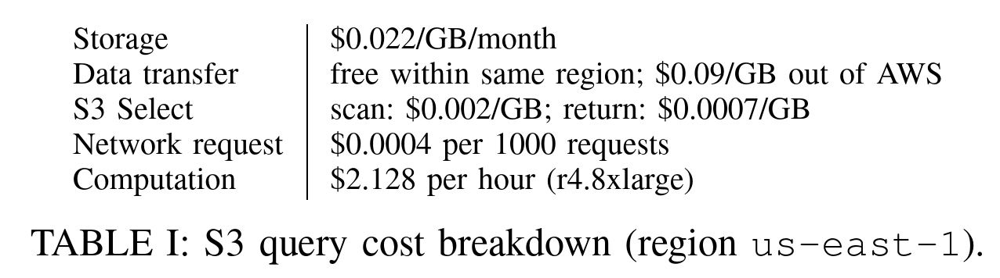
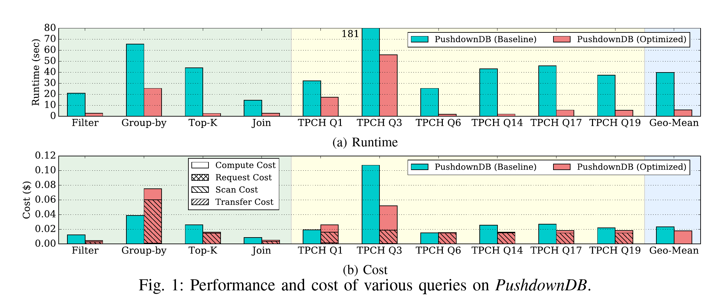

title:: PushdownDB: Accelerating a DBMS using S3 Computation
type:: [[Paper]]
conference:: [[ICDE '20]]
doi:: [10.1109/ICDE48307.2020.00174](https://doi.org/10.1109/ICDE48307.2020.00174)
status:: [[DONE]]

- https://arxiv.org/abs/2002.05837
- http://pages.cs.wisc.edu/~yxy/pubs/pushdowndb-icde.pdf
- My Dropbox: https://www.dropbox.com/s/r52ojvy24gd0vqy
-
- 这篇 paper 主要在研究通过把一些计算下推到 S3 Select 来加速计算
-
- >  Experimentation with a collection of queries including TPC-H queries shows that PushdownDB
  is on average 30% cheaper and 6.7× faster than a baseline that does not use S3 Select.
-
- #question 这篇文章是在对比使用 S3 存储数据，然后使用 S3 Select 和不用的对比？
	- 是的，baseline 是在 server 计算，optimized 是把部分计算下推到了 S3
-
- S3 成本
- 
- 性能对比
- 
- 文章主要在关注的点是成本
-
- 如果这个优化要应用于工业界的话，应该还需要考虑这些问题
	- 多种数据格式如何支持？
		- S3 Select 只支持常见的 [[csv]]，[[JSON]] 和 [[parquet]] 等等
	- 多云的支持
		- S3 Select 的特性并不是所有的对象存储服务全都支持
			- [[Azure Blobs]] 支持: [Query Blob Contents](https://docs.microsoft.com/en-us/rest/api/storageservices/query-blob-contents)
			- [[Google Cloud Storage]] 不支持
	- 缓存
		- 数据存在 S3 上的服务大多都会实现一个 cache layer，而 S3 select 拿到的数据相对来讲更不好 cache，考虑一个请求落到 cache 和落到 S3 select 的差异，可能实际的价值还要再打一个折扣
	- S3 Select 本身的能力有限
		- 只能支持特定的操作，不支持 JOIN 等
-
- 结论
	- 从工程实现来看还是只能作为一个辅助的性能优化，目前还做不到把所有的 Query 都下推给存储
	- 或许从另一个角度说明存储层需要自行掌控(实现？)才能更好的优化
		- 参考 [[TiDB]] 和 [[CockroachDB]] 的路线
		- #question 是否有舍本逐末的嫌疑呢？
			- 采用 S3 就是为了架构简单，成本经济
			- 这篇论文对比的也是同样采用 S3 作为存储层，下推和不下推的差异
	-