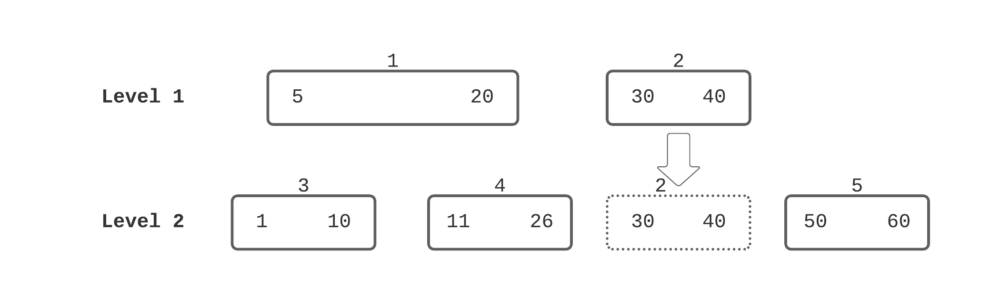

- 用于降低写放大的一个优化，继承自 [[LevelDB]]。
-
- Compaction 的时候如果发现这一层的 SST 文件跟下一层没有重叠的地方，那就可以直接把这个文件移动到下一层，不需要 Compacting
-
- 
	- 以对 Level 1 做 compacting 为例，如果发现跟 Level 2 没有重叠，可以直接把文件 2 移动过来，不需要重写文件 2
-
- 缺点在于
	- 可能会存在很多小的，没有压缩过的 SST 文件
	- 这些文件没有被 compact 过，[Compaction Filter]([[Rocksdb/Compaction Filter]]) 可能没有执行
-
- 可能的 workaround
	- 手动执行 compact
-
- 参考资料
	- [Github Wiki: Compaction Trivial Move](https://github.com/facebook/rocksdb/wiki/Compaction-Trivial-Move)
	- {{embed ((620db53c-f2d2-4363-8b3d-628493f5dd92))}}