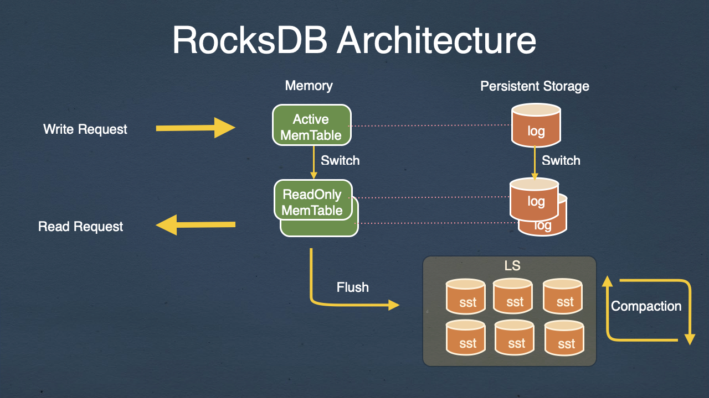

- {:height 445, :width 776}
-
- Rockset 的实现
	- 
-
- 参考资料
	- fackbook/rocksdb: [Remote Compaction (Experimental)](https://github.com/facebook/rocksdb/wiki/Remote-Compaction-%28Experimental%29)
	- [Remote Compactions in RocksDB-Cloud](https://rockset.com/blog/remote-compactions-in-rocksdb-cloud/)
	- [LSM-tree 的 Remote Compaction调度](https://zhuanlan.zhihu.com/p/419766888)
		- > 对于真正实时性要求特别高的TP/AP业务来说，shared-nothing的 架构才是满足需求的选择，而在shared-nothing架构下的remote compaction 其实并没有必要，毕竟CPU瓶颈/磁盘瓶颈 之间的差异没有那么大
		- > 那有的人会说 offload-compaction 的计算到其他的硬件（FPGA），这个阿里的X-DB 已经做过探索，其实收益相比于FPGA的成本有限，要不就是像rENANIC 为cassandra 做的一个完整的链路，不仅仅offload compaction，还包括通过SPDK/DPDK 旁路读/写和网络。不然，仅仅offload compaction 到FPGA的收益 相比于FPGA 本身的成本来说还是不够的。