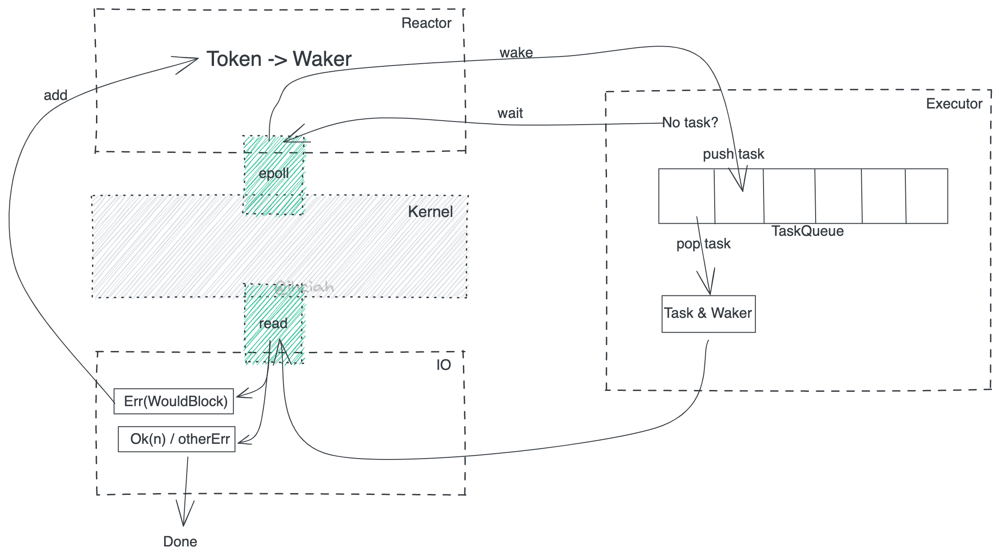

title:: Rust/Async Runtime

- 
- Runtime 实现依赖三个组件
	- Reactor
		- 存储 Waker 并在 Ready 之后唤醒任务
	- Executor
		- 负责提供 cx 接受唤醒操作，并重新调度任务
	- IO
		- IO 库需要负责将 IO 注册到 Reactor
			- 这就是为什么我们要用 `Tokio::net::TcpStream` 的原因，标准库的 `TcpStream` 是不会做这些操作的
	-
-
- 参考资料
	- [Rust Runtime 设计与实现-科普篇](https://www.ihcblog.com/rust-runtime-design-1/)