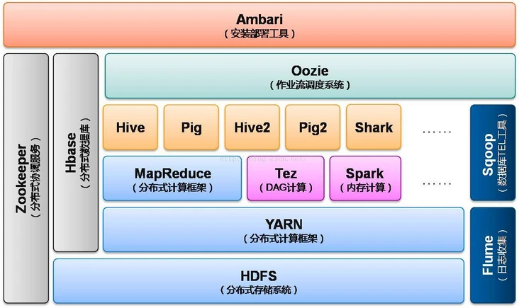

-
- 架构
	- 来自 [Spark架构](https://segmentfault.com/a/1190000037612691)
	- 
-
- 样例
	- 来自 Spark [Quick Start](https://spark.apache.org/docs/latest/quick-start.html)
	- 安装 `pyspark`
	- ```python
	  >>> textFile = spark.read.text("README.md") -> 创建一个新的 DataFrame
	  
	  >>> textFile.count()  # Number of rows in this DataFrame
	  126
	  
	  >>> textFile.first()  # First row in this DataFrame
	  Row(value=u'# Apache Spark')
	  
	  >>> linesWithSpark = textFile.filter(textFile.value.contains("Spark"))
	  
	  >>> textFile.filter(textFile.value.contains("Spark")).count()  # How many lines contain "Spark"?
	  15
	  ```
-
-