title:: Windows Azure Storage: A Highly Available Cloud Storage Service with Strong Consistency
type:: [[Paper]]
conference:: [[SOSP '11]]
doi:: [10.1145/2043556.2043571](https://dl.acm.org/doi/10.1145/2043556.2043571)

- 论文链接
	- [SIGOPS](https://sigops.org/s/conferences/sosp/2011/current/2011-Cascais/printable/11-calder.pdf)
	- [IPFS](https://cloudflare-ipfs.com/ipfs/bafybeieewxuxmbvkn2xhkpxczsgkhk5phs24fd25rtunnq43w4oeikl4ky)
	- [Video of talk](https://www.youtube.com/watch?v=QnYdbQO0yj4)
	- [Slide of talk](https://sigops.org/sosp/sosp11/current/2011-Cascais/11-calder.pptx)
	-
- [[Azure Blobs]]，[[Azure Disks]], [[Azure Files]] 等存储服务都是基于同一套架构搭建的
- 除了传统的存储服务之外，这套架构还支持了
	- [[Azure Queues]]
	- [[Azure Tables]]
-
- 先进，非常先进。
- ---
- 关键特性
	- 强一致
	- 全局可共享的命名空间
	- 灾难恢复
	- 多租户和存储成本
		- WAS 对存储成本的理解是比用户在自有硬件上承载相同的负载要更低
- Global Partitioned Namespace
	- WAS 采用全球统一的命名规则
	- `http(s)://AccountName.<service>.core.windows.net/PartitionName/ObjectName`
	- 其中
		- service 指 WAS 提供的各项存储服务，包括 `blob`，`table` 和 `queue`
		- AccountName 是用户的帐户名
		- PartitionName 是一组资源的集合
			- 对应到 [[S3]] 的话，PartitionName 就是 Bucket Name
			- 对 Table 来说就是一张表，对 Queue 来说就是一个队列
			- 现在 [[Azure Storage]] 应该是叫做 Container 了
		- ObjectName 是就是一个特定资源的 Key 的
			- 对应到 [[S3]]，可以叫做 Object Key
	- 跟传统的 [[S3]] 设计是不一样的
		- 一般的 S3 设计不会在全局的路由中加上帐户名
		- Bucket Name 就是全局共享的
		- 国内厂商的话，有 [[COS]] 采用了类似的设计
		- 按照 Paper 中的说法，AccountName 会用来定位主存储集群和数据存储的数据中心
		- 从商业上考虑，云供应商可以为不同的 AccountName 提供不同的服务级别
		- 从实际的体验上来看，AccountName 会跟性能的指标和数据的可用性级别相关
		- 以现在的一个实际创建流程截图为例
			- 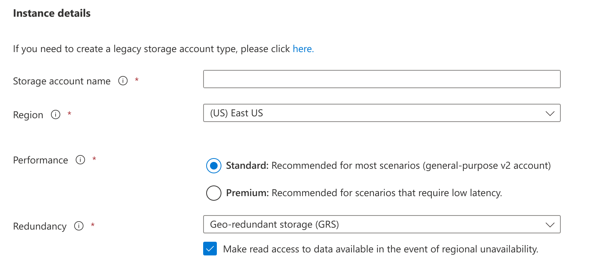
		- Redundancy 的可选项列表
			- 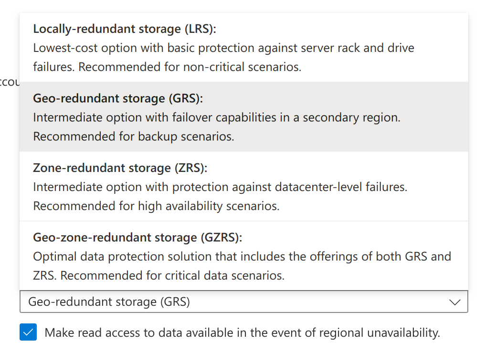
		- 这个 Account 下的所有资源都会共享相同的配置
	- 突然想到这个设计的一个妙处，这里展开说一下
		- 大多数对象存储系统受到 S3 影响比较大，我们把数据冗余度和数据访问频次混合在了一起，通过 [[存储级别]] 来配置
		- 比如说
			- Standard：标准存储
			- Standard_IA： 低频存储
			- Archive: 归档存储
			- One Zone-IA: 其他的存储级别会在至少三个 AZ 中存储一份，这个存储级别只存储一份，价格会便宜 20%
		- 具体到实现上，大家可能会用三副本来实现 Standard，用
		- 但是 WAS 这里就把这两个维度拆开了，变成了正交的关系
			- Account 级别配置 Redundancy
			- Blobs 级别可以配置 Access Tier
		- 感觉非常的优雅而合理
- High Level Architecture
	- 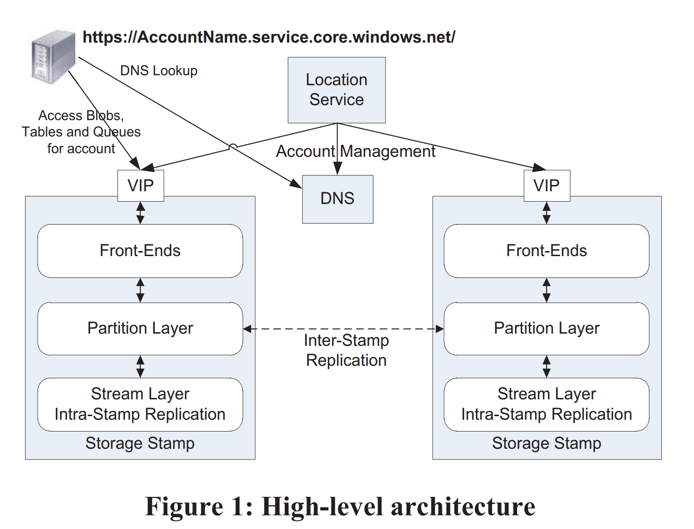
	- Storage Stamps
		- 每个 Storage Stamps 是由 N 个机柜组成的集群
		- 每个机柜是一个独立的故障域，有冗余的网络和供电
		- 一般来说每个集群有 10 - 20 个机柜
		- 每个机柜内有 18 个存储节点
		- 每个集群可提供 2PB 左右的原始存储空间
			- 注意这是在 2011 年，硬盘容量普遍是 1 TB
				- *那一年泰国洪水，让机械硬盘大涨价*
			- 现在主流服务器硬盘的大小已经是 8TB/10TB 了，行业内正在突破单盘 20 TB
		- 论文里面还提到空间利用率的问题
			- 为了容量，事务和带宽中取得平衡，WAS 会尽量保证空间利用率在 70% 左右
			- 会尽量避免利用率超过 80%，因为要预留 20% 的空间来防止寻道时间过长和灾备
			- 当空间超过 70% 的时候就会主动触发迁移，将 accounts 迁移到别的 stamp
			- #question 如果单个 Account 存储的数据超过 Stamp 怎么办？
				- 凉拌，看起来设计上就不允许超过
				- [文档](https://docs.microsoft.com/en-us/azure/storage/common/scalability-targets-standard-account) 给出了每个 storage account 的最大配额
					- 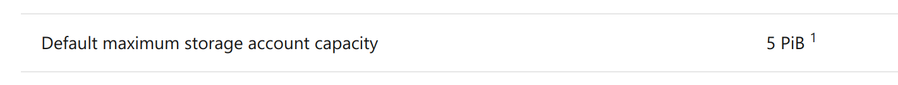
				- 注意这是整个 storage account 共用的
				- 不过 Azure 在文档页高亮了提示，如果超过配额可以找客服申请
					- 我推测应该是会存在更大的 Stamp，可以将这个 Account 迁移过去
	- Location Service (LS)
		- **The location service manages all the storage stamps.**
		- LS 会负责所有 Storage Stamps 的管理，将 Account 映射到 Storage Stamps，处理 Account 在 Stamps 之间的迁移
		- 它本身会在两个地理位置不同的数据中心部署用来做灾备
		- LS 会支持增加新的 Region，新的 Location (感觉上是 AZ 的意思) 和新的 Stamps
		- 论文中给出了一个典型的 Account 创建流程
			- App 请求创建一个新的 Account，请求中会携带指定的 Location
			- LS 会在指定的 Location 选择一个 Stamp 作为该帐号的主 Stamp
				- 选择的算法中会基于所有 Stamp 的负载信息做一些启发式分析
				- 比如说 Stamp 的存储负载，流量和事务的频次
			- 然后 LS 会在这个 Stamp 中存储 Account 相关的 Metadata 信息以通知 Stamp 开始处理这个 Account 的流量
			- 最后 LS 会更新 DNS，将 `http(s)://AccountName.<service>.core.windows.net/` 的解析目标修改为主 Stamp 的 VIP
	- Three Layers within a Storage Stamp
		- Stream Layer
			- **This layer stores the bits on disk and is in charge of distributing and replicating the data across many servers to keep data durable within a storage stamp. **
			- 实际上可以理解为一个跨节点的大号 SSD
			- 它负责对外提供 Stream 的抽象
				- Stream 是由 Extents 组成的有序列表，Extents 表示一组连续的数据 Chunk
				- 处理如何存储，如何复制等问题，不理解上层的抽象和语义
				- 只负责写，读取请求由上层的 Partition Layer 处理
		- Partition Layer
			- 主要功能包括
				- 管理和理解上层业务抽象：Blob，Table，Queue
				- 提供 Object Namespace
				- 为 Object 保证事务顺序和强一致性
				- 在 Stream Layer 之上存储数据
				- 缓存
			- 此外还会提供一些基于 PartitionName 的负载均衡
		- Front-End (FE) layer
			- 一组无状态服务
			- 请求进来的时候完成认证，然后路由到对应的 Partition Server
			- 系统会维护一组 Partion Map，然后 FE 会 cache 这个 map 来提供转发的功能
			- 论文还提到 FE 会从 Stream Layer 直接提供大对象并缓存一些经常访问的数据
				- #question 这个有点奇怪，按照目前的设计，FE 还需要直接从 Stream 读取数据吗？
	- Two Replication Engines
		- Intra-Stamp Replication (stream layer)
			- stream layer 内部的同步 Replication 在 Write IO 的核心路径上
			- Block 粒度(每一笔 IO)
			- 应该是每次写入的时候会写入位于不同节点的多个副本
			- 只有 replication 同步成功，写入请求才会返回成功
		- Inter-Stamp Replication (partition layer)
			- 跨 Stamp 的异步 Replication 不在 IO 核心路径上
			- Object 粒度 (包括跟这个 Object 相关的事务)
			- 用来提供
				- 用户的数据冗余，作为灾备
				- 前面提到的跨 Stamp 迁移 Account
		- Why two ways？
			- 他们针对的是不同场景
			- Intra-Stamp Replication 想处理的是硬件故障
			- 而 Inter-Stamp Replication 想处理的是整个机房挂掉的场景
			- 前者在用户的核心 IO 路径上，所以延迟要求很高；而后者不在，所以只要速度能接受就行
- Stream Layer
	- *重头戏登场*
	- The stream layer provides an internal interface used only by the partition layer.
	- Stream 提供一个类似于 file system 的 API，只不过所有的写入都是 Append Only 的
		- 它支持客户端 open，close，delete，rename，read，append 和 concat
	- 一个 Stream 是一个由 Extent 组成的有序列表，而 Extent 是一组连续的 Append Block
	- 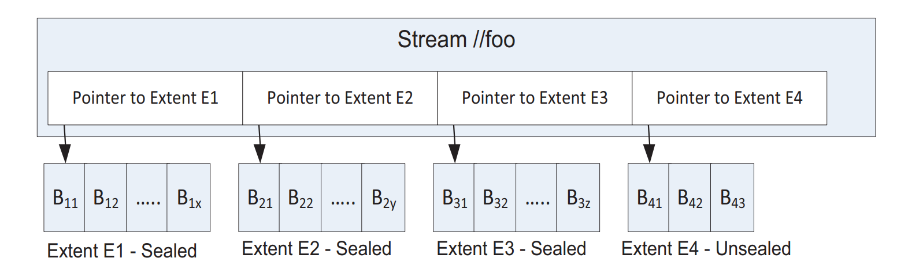
	- 注意这里的 `Sealed`
		- Sealed Extent 就不能再 Append 新数据了，只有最后一个 Unsealed Extent E4 可以追加新数据
		- 论文明确指出 Stream 只有最后一个 Extent appendable，之前的 Extent 都是 immutable 的
	- Block
		- 读写的最小单元，最大 4MB
		- Client 可以不断的向 Extent 追加不同 size 的 Block
		- 读取数据的时候，不管读多少，整个 block 的内容都会被读取
			- WAS 在 block level 存储一个 checksum，每次读取的时候会校验数据是否正确，防止静默错误
			- 除此以外，整个系统之后每个 block 每隔几天就会被重新校验一下
		- 这个概念实际上是暴露到用户侧的
			- azblob 的用户上传大文件的时候就需要连续上传最大 4MB 的 block
			- 然后最后调用 Put Block List 接口来 commit
			- 最新的版本中将这个限制放开到了 4000 MiB，推测内部的实现应该改了
			- 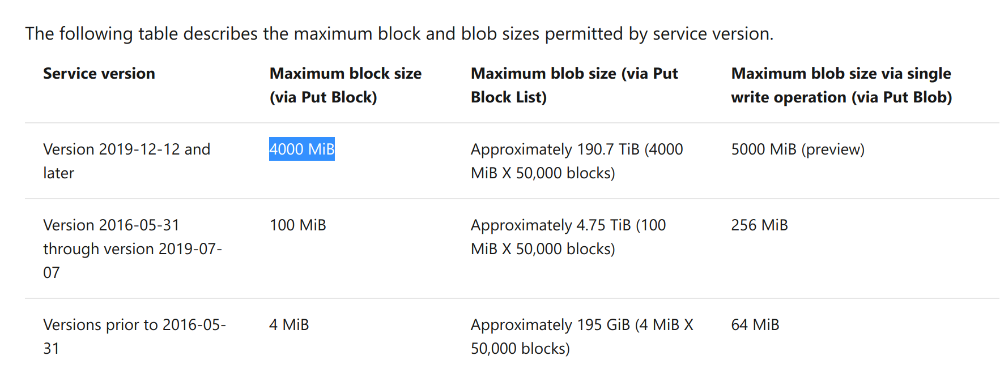
	- Extent
		- 复制的最小单元，默认的配置是三副本
			- #question 前面提到 Intra-Stamp Replication 是 Block 粒度的备份，跟这里的描述似乎有些冲突
				- 前文的原话是
					- > intra-stamp replication is focused on replicating blocks of disk storage that are used to make up the objects.
					- 感觉这里的 Block 应该在指代不同的东西
					- `blocks of disk storage` 指磁盘上连续的 block，也就是 Extent，并非上面提到的 Block
		- 每个 Extent 都是一个 [[NTFS]]  文件，包含一组连续的 Block
		- 小文件优化
			- Partiton Layer 会将小文件 append 进同一个 extent 甚至是同一个 block
		- 大文件优化 (Blobs)
			- Partition Layer 会将大文件拆分成不同的 extent
		- Partition Layer 会跟踪每个 Object 由哪个 Stream，Extent 及其 Offset 组成
	- Stream
		- Stream 是一组 Extent **指针** 的有序列表，支持追加写最后一个 extent 和随机读
		- 从已有的 Stream 中的部分内容构造出一个新 Stream 是一个开销很小的操作
			- 因为只需要更新一组指针
			- 这个特性能用于优化 Copy 相关的操作
				- #idea 难怪 [[azblob]] 支持 [Put Blob List](https://docs.microsoft.com/en-us/rest/api/storageservices/put-block-list) 这种操作
					- 先进啊，太先进了
			- 此外灾备的时候也很有用处
		- 只有最后一个 Extent 可写(append)，前面的 Extent 都是 immutable 的
	- Stream Manager and Extent Nodes
		- 接下来看看组成 Stream Layer 的组件
		- 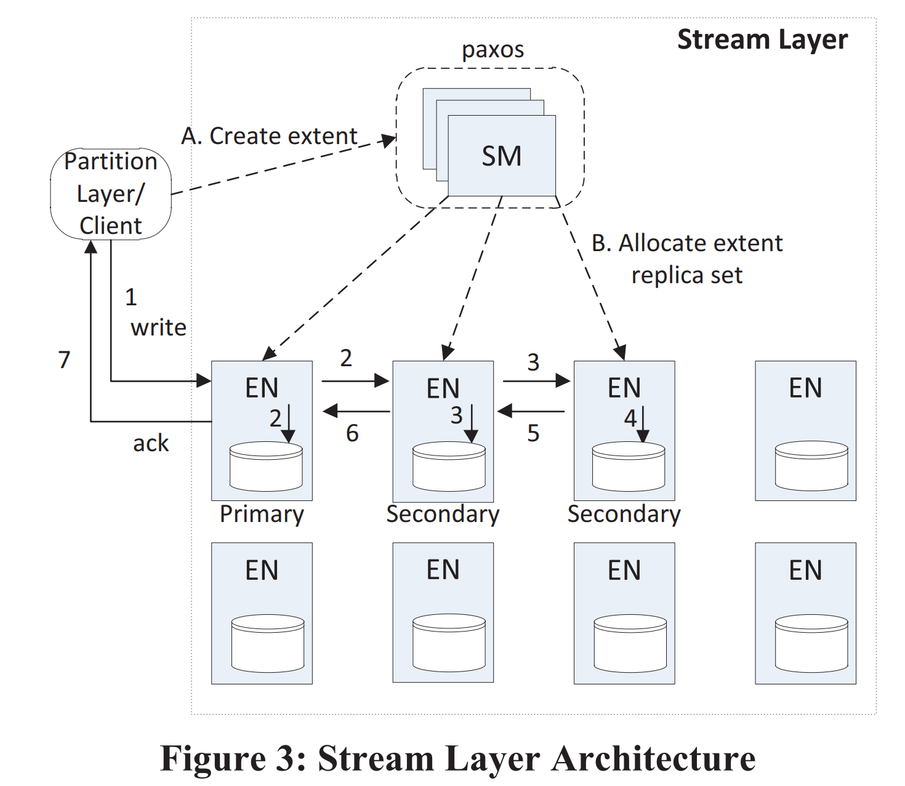
		- Stream Manager (SM)
			- The SM keeps track of the stream namespace, what extents are in each stream, and the extent allocation across the Extent Nodes (EN).
			- SM 本身是一个 [[Paxos]] 集群，不在读写的关键路径上
			- SM 主要负责的任务
				- 维护 Namespace 和所有活跃的 Streams & Extent
				- 监控所有 EN 健康状态
				- 创建和分配 Extent 到 EN
				- 当固件出故障时执行异步复制
					- 某个 Extent 的副本数不满足要求时
					- 这个操作的时候对故障域会有感知，尽量把不同的副本分配到不同的故障域中
				- GC 没有被引用的 Extent
				- 对 Sealed Extent 执行纠删码
					- #idea 看起来像是某种降低成本的策略
						- 活跃的副本做三副本，提高读写性能
						- 不活跃的，只读的副本转成纠删码，节省存储成本，具体的算法可能后面会介绍
			- SM 只跟踪 Stream 和 Extent，数量级比较少，所有的数据都能直接放在内存中
				- 每个 Stamp 会维护不超过 10W 个 Stream 和不超过 5KW 个 Extent
				- 这些数据能放进 32GB 的内存空间里面
			- #question SM 内存中的数据会落盘吗？
				- 目前还没看到这些细节
		- Extent Nodes (EN)
			- Each extent node maintains the storage for a set of extent replicas assigned to it by the SM.
			- 每个 EN 有 N 块硬盘，完全由这个 EN 管理
			- EN 对 Stream 无感知，只了解 Extent 和 Block
			- Extent 的内部结构
				- 一个 Extent 是一个独立文件(在 NTFS 上)
				- 内部包含数据块以及它的 checksums，此外还有数据块 offset 的索引
			- 每个 EN 会知道它有哪些 Extent 以及他们的 replica 在哪里
			- EN 之间会互相通信来复制客户端的写入或者创建额外的副本
	- Append Operation and Sealed Extent
		- Append 操作是原子的，不存在中间状态
			- #question 怎么做到的？听起来需要底下的文件系统提供一些保证。
			- 如果 append 操作失败了，客户端可以重试(或者 seal 当前的 extent)
				- 相对的，客户端需要能够处理一个 block 被 append 多次的情况
				- 对 metadata 和 commit log stream
					- 每个事务会被分配一个序列号
					- 而重试的这个事务会使用同一个序列号，所以重复的 block 会被 last succeeded write 覆盖
				- 对 row/blob 数据
					- 所以成功写入的数据才会被 RangeParititon 引用
					- 之前的 block 会因为没有被 reference 被 SM GC 掉
				- 后面会更详细的介绍这些逻辑
		- 多个 Block 可以作为一个原子操作同时 Append：“multi-block append”
			- 看起来这个 batch 可以做得很大
		- Stream 的最小读取单元是一个 Block
			- 前文中有提到，每个 block 是有自己的 checksum，每次读的时候会进行校验
		- 每个 extent 会有一个目标大小(由客户端指定)
			- 当这个目标大小达到时(跟 block 的边界对齐)，这个 extent 会被 seal，并创建一个新的 extent
			- 一个 extent seal 之后就变成 immutable 的，SM 可能会对这个 seal 做一些优化
				- 比如说将较冷的 seal 转为纠删码形式进行储存
			- streams 中的 extent 不要求大小一致，他们在任何时候都能被 seal，也能变得非常大
	- Stream Layer Intra-Stamp Replication
		- Partition Layer 的正确性基于 Stream Layer 提供的如下保证
			- 一个记录写入成功之后(append & ack)，从任何一个副本读取这个记录都会获得相同的数据 -> 数据是不可变的
			- 一旦一个 extent 被 seal 之后，从任何一个 sealed 副本读取都会获得相同的数据
				- 注意这里强调了是 sealed replica
				- 也就是说会存在某个时刻，这个 extent 的某个副本还没有被 seal
			- WAS 的数据中心中有其他的安全机制来防范恶意攻击，所以这里不需要考虑这种情况
		- Replication Flow
			- 
			- 如图所示，当创建 Extent 的时候 (Step A)，SM 会分配一个一主两从的 Extent Replica Set (Step B)
				- 分配好 Extent 之后，这些信息会返回给 client
				- 这个状态会被存储在 SM 元数据中，并缓存在 client 内存里
			- 客户端的写入总是会先落到 Primary EN 上，然后 Primary EN 负责将这个写入复制到从节点上
				- #question 从图中的示意来看，这里采用了链式复制？
				- 当一个 Extent 还没有被 seal 的时候，Primary EN 和他的副本位置保持不变
				- 当客户端的写入收到 Primary EN 返回的 ack 之后，客户端就可以从任意副本中读取数据
				- Primary EN 具体要做的事情包括
					- 决定当前 append 在 extent 中的 offset
						- 最后一个 append 的位置会被当作当前副本的 **commit length**
					- 对 append 请求排序(如果存在并发的乱序 append)
					- 把 append 和被选中的 offset 发送给从节点
					- 当且仅当三个节点都写入成功时返回 ack
			- 当 Streams 中的 extent 被 seal 之后，这个流程会再次重复
			- 前面提到 Extent 的相关信息会被 Client 缓存，所以 Client 会直接向 ENs 发送请求，直到需要创建新的 Extent
			- 如果在写入的时候发生失败，Client 会跟 SM 通信，SM 会将当前的 extent 以现在的 commit length seal 并创建一个新的 extent (在其他的可用的 EN 上)
				- 整个过程平均会在 20ms 内完成
					- #idea 好快啊。。。
				- 关键点在于这个客户端可以立即开始写一个新的 extent，不需要等待特定的节点恢复
				- 与此同时，SM 会为刚刚被 seal 的 extent 创建一个新的副本，从而使得它满足冗余度的要求
		- Sealing
			- Seal 一个 Extent 的时候，SM 首先会向三个 EN 询问指定 extent 当前的 commit length
			- 然后 SM 会选择可用的 EN 中最小的 commit length
				- 考虑前面的正确性保证，大于这个 comment length 的写入都没有返回 ack
				- 相反的，在这个 commit length 之前的所有写入都已经正常返回了 ack
					- #idea 考虑前面的客户端失败的处理，如果写入返回了 ack 但是客户端没有收到，此时客户端会 retry 这个请求。
				- 所以这一步中不会出现数据丢失
			- 所有 SM 可访问的 EN 都会以 SM 选择的 commit length 进行 seal
			- seal 完成后，这个 commit length 就是不可变的
			- 如果某个 EN 在 seal 的时候无法访问但是随后又自己恢复了，SM 会强迫这个 EN 将指定的 Extent 同步到指定的 commit length 并标记为 sealed
			- 所以所有的 Extent 副本最终都会达到完全一致的状态
		- Interaction with Partition Layer
			- 这个小章节讨论脑裂的情况：SM 无法访问指定的 EN，但是 Client 访问仍然正常
			- #question 这个没读懂
	- Erasure Coding Sealed Extents
		- WAS 会运用 [[纠删码]] 来节省 Extent 的存储空间
			- 通常来说，[[纠删码]] 相比于三副本能够节省一半以上的空间 ( 3x -> 1.3x ~ 1.5x)
			- 而且相比于三副本，纠删码实际上更能提升数据的持久性
				- #question 论文这里没有将采用纠删码后这个 extent 在 stamp 内是怎么分布的，看起来是这些块会分布在不同的 SN 上？
		- WAS 仅在 Blob Storage 上采用这项优化，应该是权衡性能和成本的结果
	- Read Load-Balancing
		- Client 在发起读取请求的时候会指定一个 deadline，如果 EN 满足不了这个 deadline 就会立刻返回，不再尝试
			- #question 这个 deadline 具体是指哪个阶段的 deadline？
			- #question 读取流程是分二阶段的吗？先发送预期的 deadline，能满足才发送真正的 read 请求？
		- 这个优化也同样应用于纠删码处理之后的 Extent
			- 如果读取已有的分片无法满足 deadline，client 会向所有的分片发送读取请求，然后使用最先返回的 N 个分片来重新构造出请求需要的数据
	- Spindle Anti-Starvation
		- 这个小章节介绍了硬盘公平调度的一个优化
		- 当硬盘的队列过深的时候，可能会导致 IO 超过 2300ms 没有返回
		- 所以 WAS 开发了自己的 IO 调度器，保证出现如下情况时不再调度新的请求
			- 当硬盘已经有超过 100ms 的待处理请求被调度
			- 或者硬盘有任何已经被调度但是还没有被执行的请求超过 200ms
	- Durability and Journaling
		- Stream Layer 的保证是任何 write 请求返回 ACK 的时候，他都会至少有三个持久化的副本
		- 每个 SN 节点上都会保留一块独立的硬盘作为 Journal Drive
			- 只用来处理写入，因此可以发挥设备的全部写入带宽(没有读取竞争)
			- #question 这个 journal drive 上的数据什么时候淘汰呢？
				- 等到数据已经成功落到 data disk 之后？
		- 当 EN 处理 Append 请求时，它会
			- 将所有数据写入 Journal Drive
			- 将这个 Append 请求排入对应数据盘的队列
		- 任意一个操作成功时，EN 就会返回 ACK
			- #question 为啥？
				- 要是三个节点都只排入了队列但是还没落盘，读取不就全都失败了吗？
				- 前面公平调度会保证这个 IO 在 200ms 内完成，看起来 WAS 会允许读取有一定的延迟
				- 而且 Journal Drive 大概率会先写完，写完之后就能从内存读了
		- 如果写 Journal 先成功，数据会被 buffer 到内存中直到数据成功落盘
		- 这个优化通过引入一个不在核心路径的额外写来换取延迟优化
			- 支持连续的大量写入和更好的调度并发读写来提高吞吐
			- #question 这个优化没太理解是怎么 work 的
				- 意义在于 append 操作不需要跟这块硬盘上的读取操作竞争，使得 append 操作的 commit 延迟更低且更稳定
				- 论文中以 parition layer 的 commit log stream 作为例子
					- 没有 journal drive 的时候，平均延迟为 30ms
					- 加上了 journal drive，平均延迟为 6ms
					- 此外，延迟的方差也变小了非常多(更稳定)
- Partition Layer
  id:: 61e40501-32a7-4da1-a5ff-fbe2c26885e9
	- The partition layer stores the different types of objects and understands what a transaction means for a given object type (Blob, Table, or Queue).
	- Partition Layer Data Model
		- Object Table: OT
			- OT 可以达到数个 PB (
			- OT 会被动态的划分为多个 RangePartition
			- Partition Layer 中有如下 Object Table
				- Account Table
					- 存储分配到当前 Stamp 的所有帐号元信息及其配置
				- Blob Table
					- 存储分配到当前 Stamp 的所有帐号中的 Blob 对象
				- Entity Table
					- 存储分配到当前 Stamp 的所有帐号中的 Entity Rows
					- 这是 [[Azure Tables]] 中使用的抽象
				- Message Table
					- 存储分配到当前 Stamp 的所有帐号中的队列中的信息
				- Schema Table
					- 存储所有 OT 中的 Schema 信息
				- Partition Map Table
					- 存储所有 OT 的 RangePartition 信息，以及 RangePartition 关联的 Partition Server 信息
					- Front-End Server 使用这个表来路由请求到对应的 Partition Server
			- Blob Table, Entity Table 和 Message Table 都使用 AccountName，PartitionName 和 ObjectName 作为主键来索引和排序
		- RangePartition
			- RangePartition 是 OT 中连续的区间
			- OT 中的所有 RangePartition 都彼此不重叠
			- 而且 OT 中的 row 总是会在某个 RangePartition 中
		- Supported Data Types and Operations
	- Partition Layer Architecture
		- 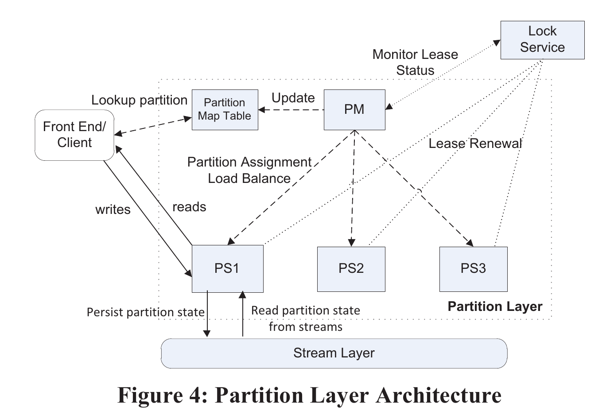
		- Partition Manager (PM)
			- 负责把  Object Tables 拆分为 RangePartitions，并且把 RangePartitions 分配到指定的 Partition Server，这些 assignement 会存储在 Partition Map Table
			- 每个 RangePartition 有且只有一个 Partition Server 在提供服务，他们之间不会出现 overlap
		- Partition Server (PS)
			- 负责处理自己绑定的 RangePartitions 部分的请求
			- 所有的持久化数据都会存储在 Stream 中，同时会维护一个缓存
			- PS 能够维护强一致的有序并发事务
				- 所有跟当前 RangePartitions 相关的请求都会落到这个 PS 上
				- 任意 RangePartitions 有且只有一个 PS 在提供服务
			- 一个 PS 可以同时提供多个 RangePartitions 的服务
				- 在 WAS 中，一个 PS 平均 serve 10 个 RangePartitions
		- Lock Service
			- 一个 Paxos Lock Service，用于 PM 选主
			- 此外，每个 PS 会维护一个 RangePartitions lease
				- 一旦租约过期，跟该 PS 关联的 RangePartitions 会被分配到其他 PS 上
	- RangePartition Data Structures
		- Persistent Data Structure
			- 持久化数据存储是一个 [[Log-Structured Merge-Tree]]
			- 每个 OT 的 RangePartition 都会有一组自己的 Streams
				- 这些 Streams 只给这个 RangePartition 提供服务
				- 但是底层的 Extent 可能被多个 Streams 共享
			- 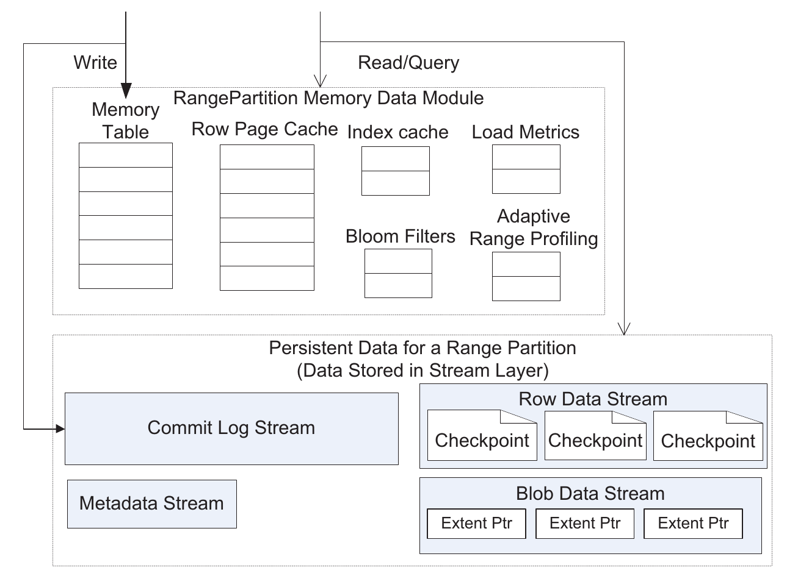
			- 这里的每个 Stream 实际上都跟能对应到 LSM 中 SSTable 的不同组成部分
			- Metadata Stream
				- > The PM assigns a partition to a PS by providing
				  the name of the RangePartition’s metadata stream
				- metadata 中会维护足够的信息使得 PS 能够加载一个 RangePartition
					- the name of the commit log stream
					- data streams for that RangePartition
					- pointers (extent+offset) into those streams for where to start operating in
					  those streams
						- where to start processing in the commit log stream and the root of the index for the row data stream
				- 同时 PS 也会在 metadata 中写入 split && merge 状态相关的状态
			- Commit Log Stream
				- 典型的 commit log
				- 记录了自从上一个 checkpoint 以来 RangePartition 相关的写入操作
			- Row Data Stream
				- 存储 checkpoints 和索引数据
					- #question checkpoint 是怎么组织的？指向某个 extent 吗？
			- Blob Data Stream
				- 只有 blob services 里会用到，存储 blob 二进制数据
		- In-Memory Data Structures
			- Memory Table
				- > in-memory version of the commit log for a RangePartition, containing all of the recent updates that have not yet been checkpointed to the row data stream
			- Index Cache
				- stores the checkpoint indexes of the row data stream
			- Row Data Cache
				- 顾名思义
			- Bloom Filters
				- 如果在 memory table 和 row data cache 中没有找到数据，就需要到 data stream 中搜索
				- 为了减少 search 的开销，PS 会为每个 checkpoint 维护一个 bloom filters，用来快速检查指定的 row 是否 **不在** 某个 checkpoint 中
	- Data Flow
		- 当 PS 收到写请求的时候，就会把请求追加到 commit log 中，然后加进 memory table
		- 当 memory table 或者 commit log 的 size 达到阈值时，PS 就会把 memory table 中所有的数据都存进一个新的 checkpoint，同时，相关联的 commit log 也都会被清除
		- 跟其他的 LSM 实现一样，PS 也会执行一个 compact 的操作，定期把旧的 checkpoint 合并成更大的 checkpoint
		- 这里对 Blob 有特别的处理
			- blob 的数据不视为 row data 的一部分，不放进 memory table (避免 memory table 过大)
				- 相对的，row data 中只会存储 blob 的 extent 和 offset，长度
			- 在创建新 checkpoint 的时候，从 commit log 中删除的数据，会以 extent
			  concatenation 的形式追加到 blob data stream 中。
				- 注意这个操作是零拷贝的，只需要追加 extent 的指针
			- 这个优化是为了减少 stream write 的数据
				- 因为 blob 的数据被单独存放在 blob data stream 中，以 extent pointers 的形式引用，不会被 raw data streams 重复 checkpoint
	- RangePartition Load Balancing
		- PM 会执行以下操作来维护 partition layer 的负载均衡
			- Load Balance
				- 如果某个 PS 负载过高，PM 会将某些 RangePartitions 移到
			- Split
				- 如果某个 RangePartition 负载过高，PM 会将 RangePartition 拆分为多个(更小的，不重叠的)RangePartitions，并分配到其他的 PS 上
			- Merge
				- 如果某些 RangePartition 负载过低，PM 会将他们合并成一个更大的 RangePartition
					- 看起来是要求 key 连续
		- partition layer 会保持 RangePartition 的量在低水位和高水位之间，动态扩缩容
			- 平衡状态下会稳定在低水位的
			- 如果有突发的大量请求，分区就会被 split
			- 如果分区的数量到达高水位，系统就会提高 merge 率来使得分区的数量逐渐接近低水位
				- 注意这里有一个内存的要求
				- stream and extent metadata 需要能够完全存储在 SM 的内存中
		- 对每个 stamp，大概每天能观察到 75 次 split 和 merge，200 次 RangePartition 负载均衡
		- Load Balance Operation Details
			- WAS 会跟踪每个 PS 和每个 RangePartition 的负载，包括
				- transactions/second
				- average pending transaction count
				- throttling rate
				- CPU usage
				- network usage
				- request latency
				- data size of the RangePartition
			- PM 会维护所有的 PS 的心跳，PS 通过心跳为上报这些信息
			- 如果 PM 发现某个 PS 负载过高，PM 就会向 PS 发送命令，要求 PS 执行 split
				- 如果 PM 发现某个 PS 负载很高，但是没有哪个 RangePartition 是高负载的，PM 就会从这个 PS 上拿走一些 RangePartition
			- 交互过程
				- PM 发送 offload 命令给 PS
				- PS 会立即写入一个新的 checkpoint
				- checkpoint 写入完成后，PS 会返回 ACK 通知 PM offload 已经完成
				- PM 之后会把这个 RangePartition 分配给别的 PS，并更新 Partition
				  Map Table
				- 新的 PS 会加载这个 RangePartition 并开始接收请求
		- Split Operation
			- 如果 PM 发现某个 RangePartition 的负载过高，PM 会要求 PS 执行 Split 操作，PS 会决定从什么地方开始 Split
			- Split 有两种情况
				- 根据 size split
					- RangePartition 会维护所有 objects 的 total size 以及 split key (有点像中位数，从这里开始切能大致上把 RangePartition 分成两半)
					- PS 使用 RangePartition 的 split key 来执行 size split
				- 根据 load split
					- PS 会维护一个 Adaptive Range Profiling，动态的跟踪哪些 key range 有最高的负载
			- 交互过程
				- > split a RangePartition (B) into two new RangePartitions (C,D)
				- PM 命令 PS 将 B 拆分为 C 和 D
				- PS 对 B 执行一次 checkpoint，然后停止响应请求
				- PS 使用 Stream 提供的 “MultiModify” 操作来获取 B 的每一个 streams (metadata，commit log，data)
					- 使用跟 B 一样的 extents 及顺序为 C & D 创建新的 streams
						- #question 所以 B，C，D 会有完全一样的历史，只是被分配了不同的 key range？
							- 然后历史中无用的记录会通过 GC 来清理？
					- PS 在 C 和 D 的 metadata 中写入新的 key range
				- PS 开始处理 C 和 D 的请求
				- PS 通知 PM split 完成了，PM 会更新 Partition Map Table
					- 之后 PM 可以把某个 RangePartition 移动到别的 PS 上
		- Merge Operation
			- 交互过程
				- > The following steps are taken to merge C and D into a new RangePartition E.
				- PM 会首先把 C 和 D 移动到同一个 PS 上
				- PS 会为 C 和 D 创建新的 checkpoint，然后停止 C，D 的访问
				- PS 使用 MultiModify 命令来为 E 创建新的 commit log 和 data streams
					- 每个 stream 都是 C & D 的 concatenation
					- `"E commit log extents" = concat("C commit log extents", "D commit log extents"`
						- >  the extents in the new commit log stream for E will be all of C’s extents in the order they were in C’s commit log stream followed by all of D’s extents in their original order.
					- #question 为什么可以直接这样 concat 呢？不需要某种形式的 merge 吗？
						- C 和 D 完全不重叠，所以 commit log 的 reply 顺序不影响最后的结果
						- 虽然论文中好像没有明确之处，但是 merge 应该是要求 key range 连续
							- 所以这里的 C & D 的顺序应该是可以按照 `[11-20],[21-30]` 这样有序的排一下的
						- 其他的 stream 应该也是类似的原因
				- PS 会为 E 创建新的 metadata stream
					- the names of the new commit log and data stream
					- the combined key range for E
					- pointers (extent+offset) for the start and end of the commit log regions in E’s commit log
					- the root of the data index in E’s data streams
				- PS 开始接收 E 相关的请求
				- PM 更新 Partition Map Table
	- Partition Layer Inter-Stamp Replication
		- 每个 account 会有一个 primary stamp，此外还会被分配一个或多个  secondary stamps
		- 当创建一个 account 的时候，Location Services 会在不同的区域中各挑选一个 stamp
			- 然后 primary stamp (P) 会处理所有的 live traffic
			- secondary stamp (S) 则只处理  inter-stamp replication traffic
		- 当 P 收到新的请求的时候，这个变化会在 stamp 内部通过 stream layer 被复制，然后返回 client
			- 当 P commit 了这个请求，P 的 partition layer 会异步的将这个变化同步到 S
		- 因为这个过程是异步的，所以 P 的 recent changes 可能会出现没有被同步的情况
			- 在生产环境中，这个延迟平均是 30 s
		- 这个机制会用来做灾难恢复和数据迁移
			- 灾难恢复的时候会出现数据丢失，但是数据迁移的时候会执行 clean failover，不会出现数据丢失
		- 当恢复/迁移完成后， Location Service 都会把当前活跃的 stamp 标记为这个 account 的新 primary stamp，将对应的域名解析到这个 stamp 的 VIP 上
			- 注意整个 failover 的过程中，域名是不发生变化的
- Application Throughput
	- 一些性能数据
	- WAS Table operation throughput
		- performing random 1KB single entity get and put requests against a single 100GB Table
		- It also shows batch inserts of 100 entities at a time – a common way applications insert groups of entities into a WAS Table
		- 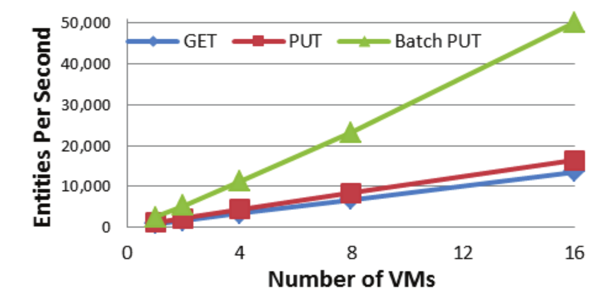
	- randomly getting and putting 4MB blobs
		- 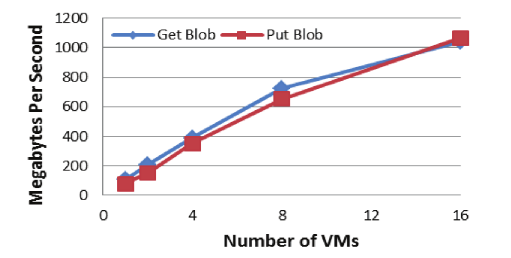
	- 挺好看的线性扩展图
- Workload Profiles
	- > Usage patterns for cloud-based applications can vary significantly.
	- 这个部分展示了一些真实的 workload
	- 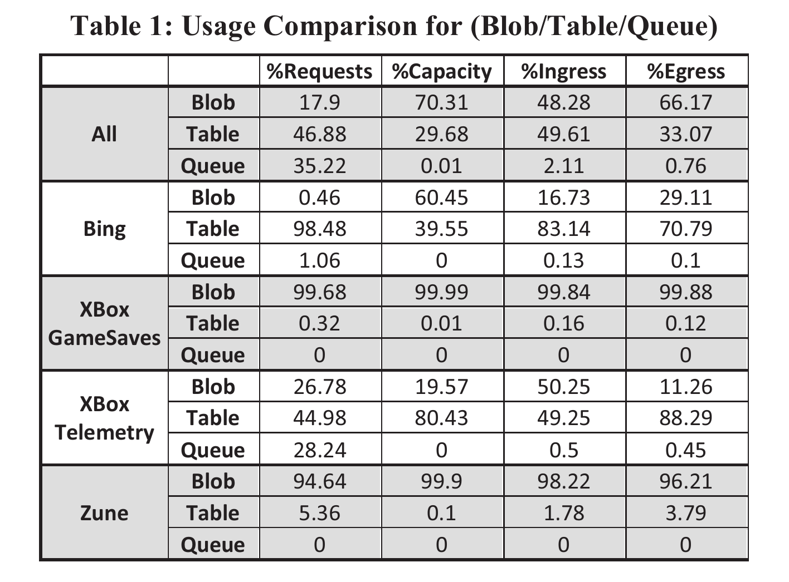
- Design Choices and Lessons Learned
	- Scaling Computation Separate from Storage
		- 存算分离！
		- 存储和计算可以独立扩展
		- 多租户场景可以提供更好的隔离
		- 支持更多的 workload
	- Range Partitions vs. Hashing
		- WAS 使用 range 分区而不是 hash (ceph)
		- 一个原因是 range 分区可以更好的做性能隔离
			- hash 可以方便的将负载均衡到多个节点上，但是会失去数据的局部性
		- range 分区使得 WAS 能够把同一个用户的数据放到一起便于限速和避免 “坏邻居”
			- 这对多租户的应用来说非常重要
		- range 分区的缺点是存在局部的数据热点(顺序写场景)
			- 比如说用户不断在某个表的末尾追加新的数据
			- 所有的写入都落到了最后一个 RangePartition 中
			- 目前没有好的方案，只能让用户在业务上自行拆分不同的 PartitionName, 来避免这种情况
	- Throttling/Isolation
		- > The system uses a Sample-Hold algorithm to track the request rate history of the top N busiest AccountNames and PartitionNames.
	- Automatic Load Balancing
		- >  We found it crucial to have efficient automatic load balancing of partitions that can quickly adapt to various traffic conditions.
	- Separate Log Files per RangePartition
		- > Having separate log files enables us to isolate the load time of a RangePartition to just the recent object updates in that RangePartition.
	- Journaling
		- WAS 最开始发布的时候是没有 journaling 的，在线上发现了同一块盘上的竞争读写严重影响了性能
		- > We found this optimization quite effective in reducing the latency and providing consistent performance.
	- Append-only System
		- > Having an append-only system and sealing an extent upon failure have greatly simplified the replication protocol and handling of failure scenarios.
		- 基于 append-only 来实现更复杂的语义能够极大的简化实现
	- End-to-end Checksums
		- > We found it crucial to keep checksums for user data end to end.
		- > We have seen cases where a few servers had hardware issues, and our end-to-end checksum caught such issues and helped maintain data integrity.
	- Upgrades
		- > we use rolling upgrades, which enable us to maintain high availability when upgrading the storage service, and we upgrade a single upgrade domain at a time.
		- >  The upgrade process is automated so that it is tractable to manage a large number of these large-scale deployments.
	- Multiple Data Abstractions from a Single Stack
		- >  Our system supports three different data abstraction from the same storage stack: Blobs, Tables and Queues.
		- > This design enables all data abstractions to use the same intra-stamp and inter-stamp
		  replication, use the same load balancing system, and realize the benefits from improvements in the stream and partition layers.
	- Use of System-defined Object Tables
		- > We chose to use a fixed number of system defined Object Tables to build Blob, Table, and
		  Queue abstractions instead of exposing the raw Object Table
		  semantics to end users.
	-
- ---
- 无用但有趣的一些小发现
	- WAS 很容易手滑打成 AWS (
		- 后来 WAS 把前面的 [[Windows]] 去掉了，只说 Azure Storage
		- 肯定跟这个没关系 (
- [[2022-01-14]] 感想
	- 有种逐渐理解了一切的感觉， [[azblob]] 之前有些奇怪的设计都有了合理的解释
- [[2022-02-03]] 感想
	- 已经都快忘光了- -