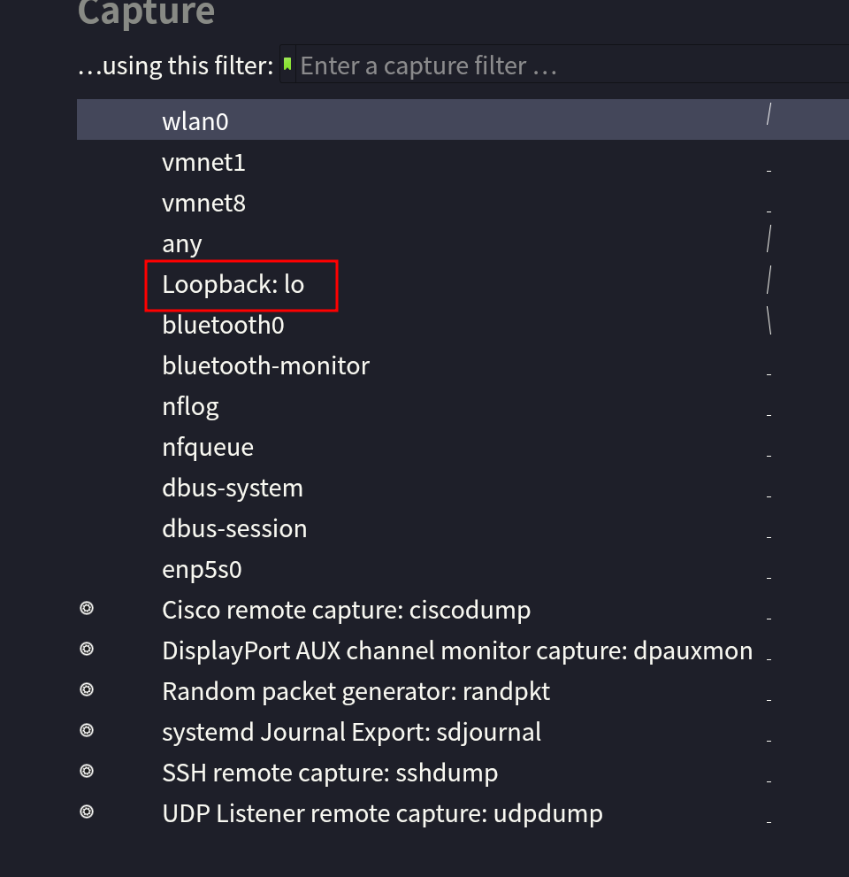

- 包分析工具
-
- [[Archlinux]] 安装
	- ```shell
	  pacman -S wireshark-qt 
	  ```
	- 注意需要把自己加进 wireshard 组，然后修改 `/usr/bin/dumpcap` 的权限
		- ```shell
		  sudo chmod +x /usr/bin/dumpcap
		  ```
-
- 启动 wireshark 之后需要等待它把所有的网卡都加载出来
	- 
- 以本地回环为例，点击 lo 就能进入网卡的实时流量界面
-
- 这时候可以在上面的 filter 过滤想要的请求
-
- 过滤本地跟 tcp 端口 9000 的 HTTP 请求
	- ```
	  http and ip.addr == 127.0.0.1 and tcp.port == 9900 
	  ```
-
- 参考资料
	- [Archwiki: Wireshark](https://wiki.archlinux.org/title/wireshark)