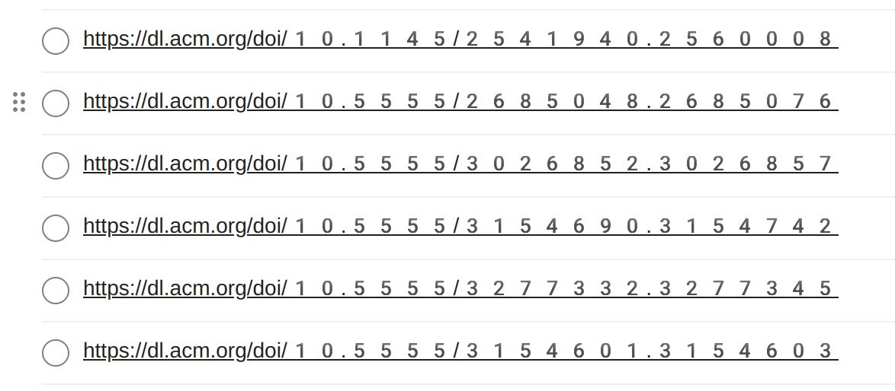
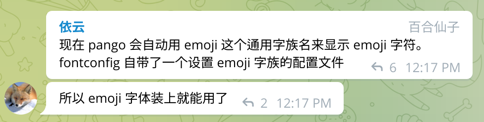

- https://www.freedesktop.org/wiki/Software/fontconfig/
- [[Linux]] 字体配置工具 (广泛运用于 Unix-like 系统)
-
- 安装 `noto-fonts-emoji` 后，字体出现奇怪的放大问题
	- 
	- 原因是自己画蛇添足的增加了 `noto-color-emoji-fontconfig` 的配置，导致选中了错误的字体
		- 
	- 把额外的 fontconfig 删掉之后就恢复正常了