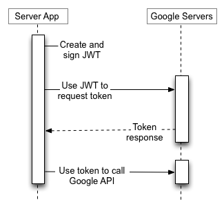

- Issue: https://github.com/Xuanwo/reqsign/issues/7
-
- 很多服务支持 OAuth2 认证，他们大多数逻辑都是一样的，但是有不少细节上不同
	- 比如说每个服务默认加载的位置不一样等等
- 现在的设计是提供一个 general 的 oauth2 支持
	- 然后在不同的服务中去引用这样的支持
	- 比如 google 就能增加一个从 `GOOGLE_APPLICATION_CREDENTIALS` 自动加载 credential 的能力？
-
- 应该不需要关心用户交互这一层的逻辑，只需要处理
	- 加载 credential
	- 自动更新 token
	- 签名请求
-
- 怎么看起来不太通用呢。。。
	- 
	- https://developers.google.com/identity/protocols/oauth2/service-account#httprest
	- Google 需要使用 client id & secret 构造 JWT 然后用来请求 token
		- > Access tokens issued by the Google OAuth 2.0 Authorization Server expire after the duration provided by the expires_in value. When an access token expires, then the application should generate another JWT, sign it, and request another access token.
	- Server to Server API
- Dropbox 好像没有 service account 的概念
-
- 看起来 OAuth2 这一层能做的事情比较少，更倾向于叫做 token
	- 输入一个 type 和 token
	- 然后 apply header，结束
- 而每个服务内部则有可能需要使用不同的方式来拿到这个 token
	- 可能是一个标准的 oauth2 流程
		- 这个已经超出 reqsign 的 scope 了，用户需要自己想办法构造一个标准 token
			- 拿到 token 之后的 refresh 流程应该需要 reqsign 来处理？
	- 可能是 google 这样的一套 server to server API
-
- 朴素的 token 支持看起来没有实际的应用场景，先把 google 的做了吧？
	- https://crates.io/crates/jsonwebtoken
-
- 稍微想一下标准的 OAuth2 这种场景
	- 如果开发者想使用 reqsign 对发给 dropbox 的请求做签名，reqsign 需要做些什么？
		- 开发者会持有自己的 client id 和 client secret
			- auth code 之类的东西需要处理吗？开发者是不是需要有自己的 OAuth2 处理逻辑？
		- 可能只需要传递一个 token/client id/client secret 给 reqsign
		- reqsign 自动检查 token 是否过期，然后自动更新 token
		-
-
- 参考资料
	- [RFC 7636: Proof Key for Code Exchange](https://oauth.net/2/pkce/)