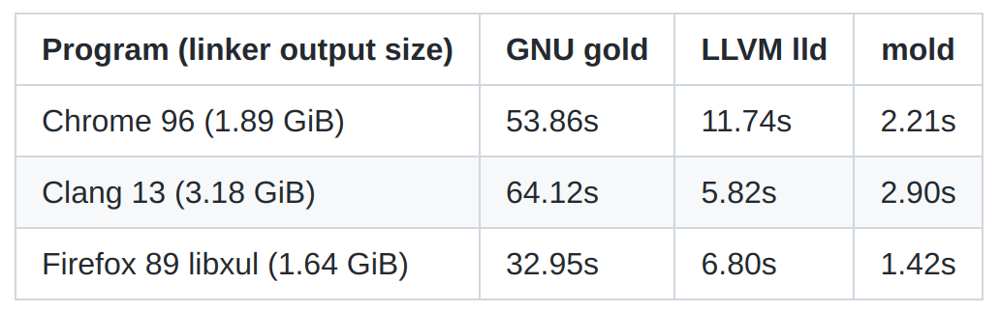

type:: [[Project]]
source:: [rui314/mold](https://github.com/rui314/mold)

-
- mold: A Modern Linker
	- 比 GNU gold 和 LLVM lld 都要快
	- 
-
- Rust 配置
	- ```toml
	  [target.x86_64-unknown-linux-gnu]
	  linker = "clang"
	  rustflags = ["-C", "link-arg=-fuse-ld=/path/to/mold"]
	  ```