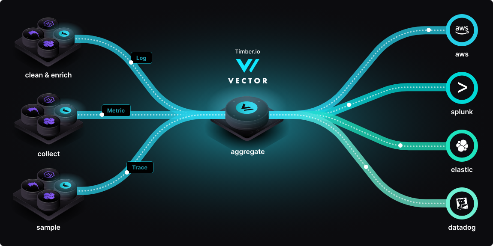

type:: [[Project]]
language:: [[Rust]]
areas:: [[Observability]]
source:: [vectordotdev/vector](https://github.com/vectordotdev/vector)

-
- A high-performance observability data pipeline.
-
- Vector is a high-performance, end-to-end (agent & aggregator) observability data pipeline that puts you in control of your observability data.
-
- 
-
- 原则
	- Reliable - Built in [[Rust]], Vector's primary design goal is reliability.
	- End-to-end - Deploys as an agent or aggregator. Vector is a complete platform.
	- Unified - Logs, metrics, and traces (coming soon). One tool for all of your data.
-