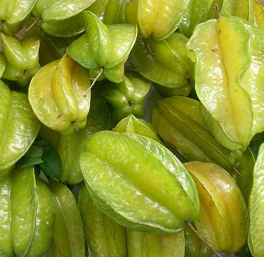
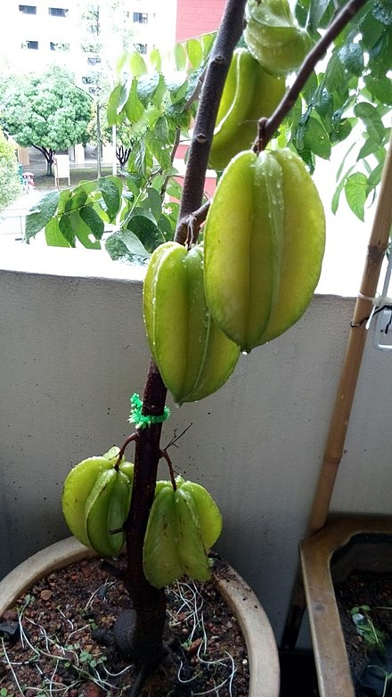

- > 杨桃味儿清甜，有一股淡淡的特别味道。有人觉得它像木瓜、桔子和柚子的复合口味儿，另外一些人则觉得它像菠萝和柠檬的混合物。杨桃可以切片单独鲜吃，也可以加入到其他菜肴或饮料中食用。
-
- > 杨桃是水分很多的水果，果汁清凉可口，解渴消暑，更有独特的风味。果实除生食外，亦可制造罐头、果汁、果酱或蜜饯，尤其酿酒更是味美而香醇。酸味品种，多用来制果汁、蜜饯和果酱，它具有特殊的风味，适合涂在吐司面包或馒头上素食用。杨桃除鲜食外还可制果酱、果汁、果膏，另外亦可制成蜜饯，吃四果冰时酸酸甜甜十分可口，果实酿酒时风味清香，是应用极为广泛的水果种类。
-
- 
-
- 
-
- [[2022-02-09]] 尝了一个，不好吃
-
- 参考资料
	- [wikipedia: 杨桃](https://zh.wikipedia.org/wiki/%E6%A5%8A%E6%A1%83)
	- [wikiHow: 如何吃杨桃](https://zh.wikihow.com/%E5%90%83%E6%9D%A8%E6%A1%83)
	-